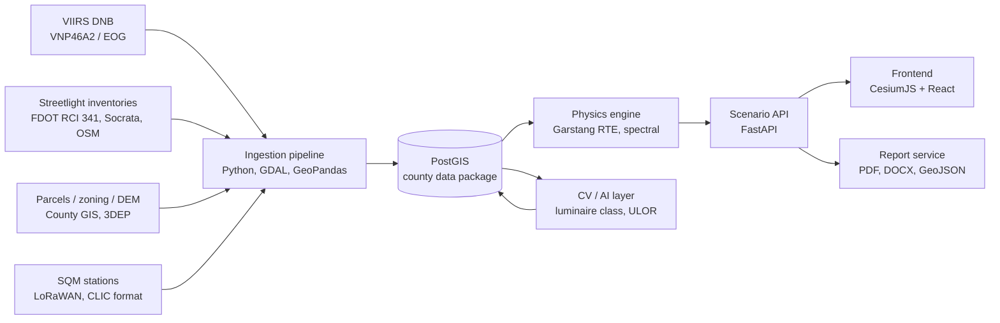
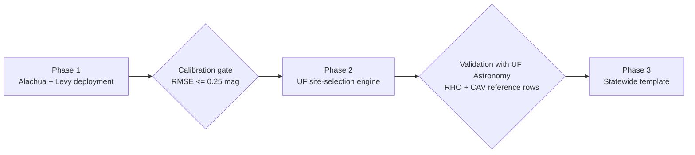

# Dark Sky Simulator v2.0 Demo & v3.0 Digital Twin — PRD / TRD

*Restoring the Milky Way: Scaling AI-Assisted Light Pollution Planning Across North Central Florida*

2026-09-21 · @Jay Rosen

### Contents

| § | Section | Applies to | Read it for |
| --- | --- | --- | --- |
| 0A | Release Plan | v2.0 and v3.0 | Constraints, scope split table, v2.0 stack, four-week plan, honesty rules |
| 0B | Agent Handoff | Both (repo layout, definition of done); WP table is v3.0 | How to start coding, decisions already made, items only Jay can resolve |
| 1 | Executive Summary & Scope | Both | Vision, personas, v3.0 KPIs, scope boundaries |
| 2 | Architecture & Data Pipeline (TRD) | v3.0 target; 2.2 open-data rows feed v2.0 | Physics engine, ingestion schema, CV/AI layers |
| 3 | Feature Specs: Modules A, B, C (PRD) | Both; nine requirement IDs are v2.0 | Inputs, outputs, requirement IDs |
| 4 | Stack, Schemas, API | v3.0; field names reused by v2.0 JSON | Frontend, backend, PostGIS DDL, REST endpoints |
| 5 | Roadmap & Onboarding Protocol | v3.0 | Phases 1–3, county onboarding CLI, risks |
| 6 | Seed Data & Defaults | Both | Every starter constant, county seed packages |
| 7 | Data Sources & References | Both (v2.0 uses public rows only) | URLs, cadence, formats |
| 8 | Knowledge Gaps & Research Prompts | Both | Deep Research prompts by module, priority |
| 9 | Sources | Both | Corpus citation keys |

## 0A. Release Plan: v2.0 One-Month Demo vs v3.0 Digital Twin

This document now describes two releases. **v2.0** is what one developer plus coding agents can ship in the month before the UF AI Days presentation on 2026-10-21 with zero funding, no sensors, no proprietary data, and two consumer GPUs. **v3.0** is the full calibrated digital twin described in Sections 1–8; v2.0 exists to earn the funding and data access that v3.0 needs. Wherever a later section says "must", read it as a v3.0 requirement unless the table in 0A.2 marks it as v2.0.

### 0A.1 Hard constraints for v2.0

- Team and time: one engineer with AI coding agents; four working weeks.
- Money: none. Hosting must be free-tier or already owned (jayrosen.design, GitHub Pages, a small free API tier); no paid imagery APIs (Google Street View at $7 per 1,000 is out; Mapillary is free).
- Data: only sources that are already public online or already cited in the research corpus (Section 7 rows without "by agreement"). No GRU, Duke, Clay, or CFEC inventories; no county Cityworks production layer; no FDOT data beyond the public RCI and Open Data Hub.
- Hardware: no sky-quality meters of any kind. Compute is a laptop with an RTX 5070 and a desktop with an RTX 3080 Ti; HiPerGator is not assumed. Both GPUs are enough for every ML task in v2.0 (all are small tabular or few-thousand-image jobs).
- Audience: must open and work on a phone as well as a laptop, because commissioners and AI Days attendees will look at it on whatever is in their hand.

### 0A.2 Scope split

| Capability | v2.0 demo (ships by AI Days) | v3.0 digital twin (funded) |
| --- | --- | --- |
| Counties | Alachua and Levy, precomputed | Any Florida county via onboarding protocol (Section 5) |
| Satellite baseline | VIIRS VNP46A2 annual medians 2012–2024 for both counties from Google Earth Engine (free research tier), EOG 2012–2013 fill; per-pixel trend and step-change detection; raw and LED-corrected radiance using literature CF (Section 2.2) | Same plus locally fit CF, monthly cadence, automated yearly refresh |
| Streetlight inventory | Public only: FDOT RCI 341 segments distributed to points, Gainesville Socrata `tk33-9jw3`, Alachua Cityworks test endpoint, OSM. Utility fixtures modeled as counts along the served road network from corpus estimates (GRU 30,000, Levy 3,135) with `confidence ≤ 0.4` shown on screen | Utility point inventories under data-sharing agreements; CV-enriched attributes; confidence ≥ 0.9 |
| Physics | Tier 1 Garstang-lite kernel: per-pixel VIIRS radiance × URF/CSF/LRF (Section 6.3) spread by a distance-decay kernel fitted to Garstang curves, run offline in Python on the desktop for a fixed set of scenario basis layers; the browser combines basis layers client-side so any control combination renders instantly | Full five-band Garstang kernel per fixture, ILLUMINA Tier 2 runs, terrain shadowing, time-of-night weighting |
| Calibration | None possible. Sanity check only against public Globe at Night points, Clear Dark Sky site values, and SQM figures in IDA applications; every output carries an "uncalibrated planning projection" badge | RMSE ≤ 0.25 mag against ≥ 5 stations per county (KPI 1.3) |
| Module A scenario engine | Shielding %, CCT cap, intensity %, curfew on/off, overlay radius around RHO and CAV, growth-trend toggle; outputs: delta map, Bortle and magnitude at named sites, kWh and $ from seed tariffs, CAPEX, simple payback, CO₂ hidden. Requirements A-01, A-02, A-07, A-08 | Amortization time series, fixture-level selection by owner and road class, NPV, wildlife spectrum flags, forkable shared scenarios, Tier 2 publish lock (A-03–A-06) |
| Module B site selection | Full MCDA over the 11-county NCFRPC region at 1 km using only open rasters (VIIRS, MODIS cloud climatology from GEE, 3DEP, FNAI, TIGER places, FDOT roads); WLC with editable weights; top-20 heatmap; scorecards; RHO and CAV reference rows; 10-year trend extrapolation from the 2012–2024 per-cell growth rate. B-01, B-02, B-06 and a simplified B-03 | Sprawl random-forest with parcel and PUD covariates, OWA, sensitivity analysis, seeing proxy, field validation campaign (B-03–B-05) |
| Module C policy dashboard | One-page legislative brief as PDF generated in the browser from the current scenario (trend, Bortle change, CAPEX, savings, payback, ordinance parameters); defensibility panel showing inventory confidence and "uncalibrated" status. C-01, C-04 | Model-ordinance annex, ESPC XLSX, SS4A/BRIC/FWC/USDA grant packs, IDSC annual-report export (C-02, C-03) |
| Machine learning | Runs on the 5070/3080 Ti: (1) per-pixel VIIRS trend and retrofit step-change detector; (2) 10-year growth forecast as gradient-boosted regression on open covariates (distance to roads and places, land cover, current radiance); (3) stretch goal: YOLOv8 luminaire detector fine-tuned on Mapillary Vistas street-light class, run on free Mapillary imagery for one corridor (US 441 across Paynes Prairie) as a proof of concept | Full CV taxonomy with ULOR and CCT classification, active-learning dataset, radiance-correction regressor, model registry |
| Backend | Mostly none. All heavy computation is precomputed on the desktop into static PMTiles and JSON; the site is static (GitHub Pages or jayrosen.design). Optional tiny FastAPI on a free tier only for the Module B weight re-ranking if client-side is too slow | FastAPI + Celery + PostGIS + object storage, RBAC, job queue (Section 4.2) |
| Frontend | React 18 + TypeScript (reuse v1 shadcn components), MapLibre GL JS with PMTiles for raster and vector layers, mobile-first layout, optional 3D terrain via MapLibre terrain; v1 Three.js sky panorama kept, textures swapped for computed sky luminance | CesiumJS globe, 3D Tiles fixtures, IES glow shaders (Section 4.1) |
| Sensors | None; Section 6.7 deferred entirely | LoRaWAN SQM network, NightSky Ledger nodes, ALAN Scout/Mapper |
| Reports and exports | PDF brief, GeoJSON of candidate sites, PNG map export | DOCX/XLSX templates, grant narratives |

### 0A.3 v2.0 technical stack (replaces Section 4 for the demo only)

Python 3.12 offline pipeline on the desktop: `earthengine-api` for VNP46A2 and MODIS cloud composites, `rasterio`/`rioxarray` for local raster math, GeoPandas for FDOT/Socrata/OSM ingestion and road-network distribution, NumPy for the Garstang-lite kernel, LightGBM for the growth model, Ultralytics YOLOv8 for the stretch CV task, `rio-pmtiles`/`tippecanoe` to publish PMTiles. Outputs land in a `public/data/` folder: baseline and basis-layer PMTiles per county, `sites.json`, `fixtures.pmtiles`, `mcda_criteria.pmtiles`, `seed.json` (Section 6 values). Frontend: Vite + React 18 + TypeScript + Tailwind + shadcn/ui from v1, MapLibre GL JS + `pmtiles` protocol, Zustand for scenario state, Recharts for payback charts, `jspdf` or browser print-to-PDF for the brief, Three.js panorama retained. Hosting: static on GitHub Pages behind jayrosen.design/dark-sky (existing URL), no server, no database. Everything in Sections 4.3–4.4 (PostGIS schema, REST API) is written so v2.0's JSON files use the same field names, so v3.0 migrates data rather than rebuilding it.

### 0A.4 Four-week build plan

| Week ending | Deliverable | Done when |
| --- | --- | --- |
| 2026-09-27 | Repo scaffolded from v1; GEE exports of VNP46A2 annual medians 2012–2024 for Alachua and Levy as COG; FDOT RCI 341, Socrata, Cityworks test layer, OSM pulled and merged; parcels and FNAI from FGDL; trend and step-change rasters computed; baseline PMTiles published | Baseline map with year slider and named-site magnitudes opens on a phone |
| 2026-10-04 | Garstang-lite kernel fitted; basis layers for shielding, CCT, intensity, curfew precomputed; client-side combiner; Bortle panel with magnitudes; seed economics wired to controls; "uncalibrated" badge and A-08 disclaimer | Flipping any control updates the delta map and payback in under 1 s; A-01, A-02, A-07, A-08 tests pass |
| 2026-10-11 | Module B criteria rasters at 1 km over 11 counties; WLC with weight sliders; top-20 sites and scorecards; RHO and CAV reference rows; growth forecast model trained on the 3080 Ti and back-tested 2012–2018 → 2024; stretch: YOLOv8 corridor run | Dr. Lada can move weights and see the ranking change; back-test error reported on screen |
| 2026-10-18 | PDF brief export; defensibility panel; mobile polish; sanity check against Globe at Night and Clear Dark Sky points documented; AI Days figures and a two-minute scripted demo path; v3.0 funding one-pager drawn from Sections 5–8 | Full demo runs on a phone over conference Wi-Fi from a cold load in under 5 s |

### 0A.5 What v2.0 must say honestly

Every screen states that skyglow values are uncalibrated projections from satellite radiance and literature coefficients, that streetlight counts for utilities are modeled estimates, and that Bortle labels are bands on a computed magnitude. The AI Days findings that justify v3.0 are: the measured 2012–2024 radiance trend for both counties, the projected sky change at RHO and CAV under a Groveland-style ordinance, the first ranked candidate list for a UF observatory, and a costed plan (Sections 5–8) for the sensors, data agreements, and calibration that turn projections into evidence.

## 0B. Agent Handoff: How to Build From This Document (full v3.0 build)

This document is the single source of truth for Dark Sky Simulator v2.0. Sections 1–3 say what to build and why (PRD); Sections 4 and 6 say exactly how, with schemas, API contracts, and every starter constant (TRD); Section 5 sequences the work; Sections 7–8 list the data feeds and the research still owed. Bracketed keys such as [GIS-VIIRS] cite the project research corpus and resolve in Section 9.

**Read in this order before writing code:** for the v2.0 demo, 0A → 6.1–6.5 (constants and county seeds) → 6.3 (interim multipliers) → 7 (open-data rows only) → 3 (the nine v2.0 requirement IDs); for v3.0, 4.3 (schemas) → 4.4 (API) → 2.1 (physics) → 6.1–6.3 → 3 → 5 (phase gates). Everything an agent needs to make the first commit is in those six places.

**Repository layout (monorepo `dark-sky-simulator`):**

```
engine/        Tier 1 Garstang kernel, spectral model, Bortle mapping; pure functions, no I/O, no county imports (CI-enforced)
ingest/        dss-ingest connectors (viirs, fdot_rci_341, socrata, arcgis, osm, utility_csv, parcels, dem, sqm); manifest schema
api/           FastAPI app, Pydantic models (ScenarioParams, results), Celery tasks, TiTiler mount
web/           React 18 + TS + CesiumJS client; generated OpenAPI client; scenario UI, Module B heatmap, Module C dashboard
ml/            YOLOv8/Xception luminaire pipeline, CCT classifier, radiance-correction and sprawl models; MLflow
reports/       Jinja2 + DOCX/XLSX/PDF templates for Module C exports
seed/          core.engine_defaults, spd_class, econ_defaults, certification_tier as versioned CSV/YAML (Section 6)
counties/      12001/ and 12075/ manifests, overlay polygons, named sites, tariff sheets (never code)
infra/         Docker Compose, Kubernetes manifests, PostGIS migrations (Alembic), k6 load tests
docs/          this PRD/TRD exported as Markdown, ADRs, onboarding runbook
```

**Work packages.** These are the v3.0 build; the v2.0 demo's work is the four weekly deliverables in 0A.4 and reuses WP1's seed files and WP2's public connectors. Each WP is independently assignable; acceptance tests are the requirement IDs and KPI rows they close.

| WP | Scope | Spec sections | Closes | Depends on |
| --- | --- | --- | --- | --- |
| WP1 Schemas and seed | PostGIS migrations for `core` and `county_<fips>`; load Section 6 seed tables; manifest validator | 4.3, 6 | Seed badge requirement (6 intro) | none |
| WP2 Ingestion connectors | Seven connectors, dedup, validation report, `dss county` CLI steps 1–4 and 7 | 2.2, 5 Phase 3 protocol, 7.1–7.3 | KPI onboarding time; inventory completeness | WP1 |
| WP3 Physics engine | Tier 1 kernel with five spectral bands, U-rating uplight curves, Bortle mapping; ILLUMINA container and Tier 1↔Tier 2 comparison | 2.1, 6.1–6.3 | Calibration gate (5 Phase 1 exit) | WP1 |
| WP4 Scenario API | Scenario CRUD, run, fork, share, tiles, jobs, WebSocket; rate limits; RBAC | 3 Module A, 4.4 | A-01–A-08; latency KPIs | WP1, WP3 |
| WP5 Client | CesiumJS map, scenario controls bound to `ScenarioParams`, delta tiles, panorama shader, Bortle panel, accessibility twin tables | 4.1, 3 Module A | A-02, A-07; page-load KPI | WP4 |
| WP6 CV and models | Street-level pipeline, CCT classifier, radiance-correction regressor, sprawl model, `ml_model_registry` | 2.3, 7.2 | Inventory attributes with `source='cv'`; sprawl raster for WP7 | WP2 |
| WP7 Module B | Criteria rasters, WLC/OWA, sensitivity, scorecards, RHO/CAV reference rows | 3 Module B, 6.6, 7.4 | B-01–B-06 | WP3, WP6 |
| WP8 Module C | Templates, ESPC XLSX, grant packs, defensibility panel, IDSC annual-report export | 3 Module C, 6.4, 7.6 | C-01–C-04 | WP4 |
| WP9 Sensors | `POST /sqm/observations`, CLIC and NSL payload decoders, station calibration offsets, calibration job | 2.2 ground truth, 6.7, 7.5 | Calibration KPI evidence | WP1 |

**Definition of done for any WP:** unit tests pass (pytest for Python, Vitest for web) with ≥ 80% line coverage on new code; every numeric constant traces to a `seed/` row with `provenance`; every requirement ID the WP closes has an automated test named after it (`test_A_06_tariff_and_rate_date_present`); engine code imports nothing from `counties/`; OpenAPI diff reviewed; `docs/` updated.

**Decisions already made (do not reopen without an ADR):** CesiumJS over Unreal or raw Three.js for v3.0 (4.1), MapLibre GL JS for the static v2.0 demo (0A.3); PostgreSQL/PostGIS over a document store; FastAPI + Celery; two-tier physics (Garstang preview, ILLUMINA publication); Clear Dark Sky Bortle-to-magnitude scale (2.1); natural zenith background 22.0 mag/arcsec²; five AS7341-aligned spectral bands; county data lives in schemas, not in code.

**Open items that need Jay, not an agent:** confirm RHO's county (this document places it in Levy, south of Bronson, per the 2026 abstract; the project brief listed it under Alachua); verify the approximate coordinates in 6.5; sign the GRU and Duke data-sharing requests (D1 in Section 8); supply the original .docx files for the two reports whose numbers were lost in conversion (Section 8 intro).

## 1. Executive Summary & Product Scope

The Dark Sky Simulator program replaces the v1 heuristic prototype (three hand-drawn Bortle polygons, a multiplicative mitigation factor, a static cost table) in two releases. v2.0, due at AI Days, puts real VIIRS radiance, public streetlight layers, and a physics-based but uncalibrated scenario engine on a phone-friendly site for Alachua and Levy counties (Section 0A). v3.0 turns that into a calibrated, multi-county digital twin whose outputs are traceable to VIIRS DNB radiance, a georeferenced luminaire inventory, and a physical skyglow model checked against ground sensors. v1 shipped as a client-only React SPA ([jayrosen.design/dark-sky](https://jayrosen.design/dark-sky), DOI 10.5281/zenodo.17252185) and informed the EPAC dark-sky Comprehensive Plan goal statement and the January 2026 EPAC vote toward DarkSky Place certification [AC-EPAC], building on the existing Conservation and Open Space Policy 5.3.7 [AC-COMP]. Together the two releases must carry that policy influence into Levy County with numbers a county attorney, an ESPC lender, or an astronomy department chair can defend.

### 1.1 Product vision and mission

One engine, many counties. Every radiative-transfer, economic, and MCDA algorithm in v2.0 is location-agnostic; everything county-specific (VIIRS tiles, streetlight inventory, parcels, zoning, tariffs, SQM stations) is a versioned data package that conforms to a published schema. Onboarding a new county means producing a data package, not touching engine code.

The mission for the 2026–2028 horizon has three parts. First, protect two named dark-sky assets in Levy County: UF's Rosemary Hill Observatory (RHO, 80 acres south of Bronson, 30-inch Tinsley reflector, currently Bortle 4) and the Chiefland Astronomy Village (CAV, Billy Dodd Memorial Observing Field, V-band 21.81–21.99 mag/arcsec² [LEVY-ASTRO], Bortle 2–3). Second, quantify what Alachua's measured +19% countywide radiance growth (2012–2024; Paynes Prairie vicinity +15%) [AC-EPAC][ABS-2026] becomes under each ordinance scenario. Third, hand UF Astronomy a ranked, defensible list of candidate observatory sites across North Central Florida.

### 1.2 Target personas

| Persona | Primary question | Primary surface | Must-have output |
| --- | --- | --- | --- |
| County Commissioners (Alachua BoCC, Levy BoCC) | What does this ordinance cost and save, and will it survive a Bert Harris claim? | Module C dashboard, one-page brief export | CAPEX, annual savings, payback, amortization schedule, nuisance-abatement language |
| EPAC members (9 voting + 1 alternate under Res. 25-59) | Which mitigation gets Paynes Prairie to Park-tier sky (≥21.2 mag/arcsec²)? | Module A scenario engine | Delta skyglow map, Bortle transition, SQM projection at named sites |
| Urban and county planners (Alachua Growth Management, Levy Planning & Zoning, Chiefland LDR staff) | Where do LZ0/LZ1 overlay boundaries fall and which parcels are non-conforming? | Module A + parcel layer, GIS export | Overlay polygons (GeoJSON/Shapefile), non-conforming fixture list by parcel |
| UF Astronomy faculty (Dr. Elizabeth Lada, Chair) | Where should a future UF observatory go so it stays dark for 30 years? | Module B site-selection engine | Ranked candidate heatmap, per-site suitability breakdown, 10-year sprawl risk |
| Conservationists (Paynes Prairie, FWC, Alachua Conservation Trust) | How much does each scenario reduce ALAN over habitat, and in which spectrum? | Module A spectral outputs | Blue-fraction (<500 nm) radiance maps, wildlife-lighting compliance flags |
| Utilities and ESPC partners (GRU, Duke LS-1, Clay Electric Schedule L, CFEC) | What is the metered, IPMVP-verifiable savings stream? | Module C ESPC model | Per-fixture kWh delta, tariff-specific $/yr, Option A vs Option B M&V plan |

### 1.3 Key performance indicators

| KPI | v1 baseline | v3.0 target (v2.0 demo criteria: 0A.4) | Measurement |
| --- | --- | --- | --- |
| County onboarding time (raw sources to validated data package) | Not possible; Alachua hardcoded | ≤ 10 working days for a Florida county with a public streetlight layer; ≤ 20 days without | Time from `county init` CLI to passing schema validation and baseline calibration report |
| Scenario latency, AOI ≤ 1,000 km² at 500 m grid | Instant (no computation) | ≤ 3 s p95 interactive preview; ≤ 30 s full-resolution run with PDF | Server-side timer on `POST /scenarios/{id}/run` |
| Scenario latency, AOI ≤ 10,000 km² (two-county region) | n/a | ≤ 10 s preview; ≤ 5 min full run | Same |
| Baseline calibration accuracy vs ground-truth SQM | None (no radiometry) | RMSE ≤ 0.25 mag/arcsec² at ≥ 5 fixed stations per county; R² ≥ 0.85 | Held-out SQM nights, 01:00–04:00 local, clear-sky, moon below horizon |
| Scenario prediction accuracy vs post-retrofit SQM | n/a | Predicted Δ within ±0.20 mag/arcsec² of observed Δ on the first pilot corridor | Before/after SQM campaign on US 441 across Paynes Prairie (pilot) |
| Inventory completeness | 0 fixtures | ≥ 90% of public fixtures georeferenced with CCT class and shielding class | Count vs utility billing line-items (GRU \~30,000; Levy \~3,135) |
| Initial page load | \~2 s | ≤ 5 s on 10 Mbps with cached tiles | Lighthouse, WebPageTest |
| Concurrent users | Static | 100 concurrent scenario sessions | k6 load test |
| Report generation | None | Legislative brief PDF ≤ 20 s; grant narrative export ≤ 60 s | Server timer |

### 1.4 Scope boundaries

In scope for v3.0 (the v2.0 demo subset is table 0A.2): Alachua and Levy counties at launch; skyglow at zenith and at 30° altitude toward named sites; public and leased utility fixtures plus modeled private residential and commercial stock; economic outputs at fixture, corridor, and county aggregation. Out of scope for v2.0: real-time smart-node telemetry ingestion (v2.1, via TALQ/D4i), glare and light-trespass photometrics at the parcel scale (DIALux/AGi32 remain the tool), and sea-turtle coastal lighting (FWC certification is a separate regime; v2.0 only flags fixtures that would fail it).

## 2. System Architecture & Reusable Data Pipeline (TRD)

*Scope note: this section is the v3.0 target architecture. The v2.0 demo implements the Garstang-lite, precomputed subset described in 0A.2 and 0A.3.*

The architecture separates four layers with hard interfaces: a county-agnostic physics engine (`[DSP]`), a schema-governed ingestion pipeline (`[GIS]`), an AI/CV layer that fills inventory attributes the utilities do not publish, and a presentation tier that never touches raw data. v1 collapsed all four into one React component tree; v2.0 makes the boundary between `engine/` and `counties/<fips>/` the primary architectural constraint, enforced by CI (engine code may not import from `counties/`).



County-specific data flows in on the left and never crosses into the engine except through the PostGIS data package schema.

### 2.1 Core physics and attenuation engine `[DSP]`

v1 had no radiometric model: skyglow was `factor = 0.75 (shielding) × 0.85 (CCT) × 0.70 (curfew) × 0.90 (dimming) × 0.80 (overlay) × (1 − intensity%)`, floored at 0.15, mapped to Bortle by `round(base − improvement × (base − 1))`, and three code paths disagreed with each other [DSP-REPO]. v2.0 replaces this with a two-tier model: a fast Garstang single-scattering kernel for interactive preview, and an ILLUMINA-class Monte Carlo run for published results.

**Tier 1, interactive kernel (Garstang 1986/1989 with Cinzano extensions).** Each source cell *i* with upward flux Φᵢ (lm) contributes to zenith sky luminance at observer *o* separated by distance *d*:

```latex
L_o = \sum_i \frac{\Phi_i}{4\pi d_i^2} \; \big[ f_{up}(\theta;\,U) \big] \; \big[ \beta_R(\lambda)\,P_R(\psi) + \beta_M(\lambda)\,P_{HG}(\psi; g) \big] \; e^{-\tau(\lambda)\, d_i \sec z} \; \Delta s
```

Here `f_up(θ; U)` is the luminaire's upward intensity distribution parameterized by TM-15-11 uplight rating U0–U5, `P_R = 3/(16π)(1 + cos²ψ)` is Rayleigh phase, `P_HG` is Henyey-Greenstein with g = 0.8 (tunable 0.7–0.9) [DSP-3D], `β_R ∝ λ⁻⁴` and `β_M` set by turbidity T (default T = 3.5 for humid Florida summer, 2.5 winter), and `τ` is optical depth along the slant path. Ground reflectance uses the LULC albedo table: paved 0.15, aged asphalt 0.10–0.18, PCC 0.35–0.40, vegetation 0.05, water 0.05. The sum is evaluated on a 500 m source grid within 100 km of the observer; beyond 100 km contribution falls below the DNB noise floor (\~2–3 × 10⁻¹⁰ W cm⁻² sr⁻¹).

**Spectral treatment.** The engine runs in five wavelength bands (415, 480, 555, 590, 680 nm centers, matching the AS7341 channels the NightSky Ledger nodes report) rather than in a single broadband. Each source has an SPD class (HPS 2100K, MH, LED 4000K, LED 3000K, LED 2700K, PCA 590 ± 5 nm, NBA) with tabulated band fractions. This is what lets a 3000K-to-2200K scenario change scotopic skyglow by \~40% while VIIRS-band radiance barely moves; v1 could not express that distinction and neither can any single-band model.

**Output units and Bortle mapping.** Zenith luminance L\_v (cd m⁻²) converts to sky quality by `m = 12.6 − 2.5 log₁₀(L_v)` mag/arcsec², and Bortle class is assigned by the Clear Dark Sky thresholds below, the same scale the corpus used for the Alachua site table [AC-RESEARCH]; research prompt A5 in Section 8 reviews alternatives. Natural background is fixed at 22.0 mag/arcsec² (≈ 0.17 mcd m⁻²) [GIS-CAL] before adding artificial luminance; the UI reports both artificial-to-natural ratio and absolute magnitude, matching the CAV baseline (ratio 0.01–0.06).

| Bortle | Zenith mag/arcsec² | Named site at baseline |
| --- | --- | --- |
| 1 | ≥ 21.99 | None in the region |
| 2 | 21.89–21.99 | Chiefland Astronomy Village, best nights (21.81–21.99) |
| 3 | 21.69–21.89 | Chiefland Astronomy Village, typical |
| 4 | 20.49–21.69 | Rosemary Hill Observatory (21.25–21.69), Paynes Prairie Overlook (\~20.9), Newberry rural |
| 5 | 19.50–20.49 | San Felasco Hammock entrance, Bronson, Chiefland city center |
| 6 | 18.94–19.50 | Suburban Gainesville |
| 7 | 18.38–18.94 | Gainesville urban fringe |
| 8–9 | < 18.38 | Downtown Gainesville |

**Tier 2, published-results engine.** For any scenario a user marks "for publication" the API queues an ILLUMINA v2 run (open-source, Aubé et al.) on the same inventory, terrain (USGS 3DEP 1/3 arc-second, \~10 m) and aerosol inputs, and stores both results. Tier 1 is calibrated against Tier 2 per county during onboarding (Section 5); divergence > 0.15 mag at any SQM station fails the calibration gate.

**Scenario controls map to physical parameters, not multipliers.** Shielding % rewrites the U-rating distribution of the affected fixture set (U5 → U0 removes uplight 90–180° entirely and reduces 80–90° near-horizontal flux, which is the dominant skyglow contributor at distance). CCT cap reassigns SPD class. Intensity cap scales Φᵢ. Curfew applies a time-weighted Φᵢ over the SQM observation window (01:00–04:00) and separately over the VIIRS overpass (\~01:30). Amortization schedule phases the fixture set conversion year by year, so the engine produces a time series, not a single end state.

### 2.2 Data ingestion schema `[GIS]`

Every county is a data package: a PostGIS schema `county_<fips>` (Alachua 12001, Levy 12075) populated by idempotent ingestion jobs, plus a `manifest.yaml` with source URLs, retrieval dates, CRS, and checksums. Ingestion is a Python package (`dss-ingest`) with one connector per source type; adding a county means writing a manifest, not a connector, unless the county has a source type never seen before.

**VIIRS DNB, 2012–2024+.** Primary product: NASA Black Marble VNP46A2 (daily, BRDF- and lunar-corrected, 15 arc-second ≈ 500 m, `DNB_BRDF-Corrected_NTL`, scale 0.1, nW cm⁻² sr⁻¹) reduced to annual medians per pixel using only `Mandatory_Quality_Flag = 0` and stray-light QA clear; secondary: EOG (Payne Institute) `vcmslcfg` annual composites for the 2012–2013 gap before Black Marble coverage, cross-calibrated by additive per-epoch offsets fit on a stable-lights mask (pixels above the World Atlas 2015 background threshold in every year). Processing runs in Google Earth Engine [DSP-MODMAP] (`scale: 500, maxPixels: 1e9`) and is exported as Cloud-Optimized GeoTIFF into the package. Lunar phase, cloud (M15 brightness temperature), and fire/flare masks are applied before compositing.

**LED blue-light correction.** The DNB bandpass (500–900 nm, center \~700 nm) does not see the 440–465 nm pump of white LEDs; 30–40% of a 4000K SPD and 15–20% of a 3000K SPD fall below the cut-on. Tucson's 18,000-fixture 3000K conversion cut lumens 63% but VIIRS radiance only about 7% [GNV-ZHAGA]. The pipeline stores raw DNB radiance and a `radiance_corrected` layer computed per pixel from the dominant lighting technology in that pixel (from the inventory and CV layer): `L_corr = L_obs × CF`, with CF = 1.00 (HPS), 1.05 (PCA/1800K), 1.43 (3000K, η = 0.70), 1.61 (4000K, η = 0.62) [GIS-VIIRS]. Where inventory is unknown the worst-case 4000K factor is applied and flagged. Scotopic and mesopic weights (S-factor 2.97 for 3000K, 4.48 for 4000K) are stored alongside for the ecological outputs.

**Streetlight inventory.** Four connectors [GIS-EXTRACT][FDOT-RCI], merged with a 5 m deduplication buffer that prefers the most attribute-rich source:

| Source | Coverage | Access | Key fields | Known gaps |
| --- | --- | --- | --- | --- |
| FDOT RCI Feature 341 (Lighting System) | State roads, District 2 (18 counties incl. Alachua, Levy) | `https://gis.fdot.gov/arcgis/rest/services/RCI_Layers/FeatureServer`, layer "Lighting System"; `where=DISTRICT='2'`, `outFields=ROADWAY,BMP,EMP,NOALMPOL,NOCONPOL,NOSTEELPOL,NOWODPOL,NOHMSLUM,NOSGMLUM,NOUNDLUM,LOCOWNER,NOLOCLUM`, `f=geojson`, `outSR=4326` | Pole counts per segment by material, luminaire counts (high-mast, standard, underdeck), owner | Segment-level, not point; poles distributed by `(EMP−BMP)×5280 / Σpoles` spacing; no CCT or wattage |
| City of Gainesville Socrata `Lights` | Public Works LED fixtures (excl. GRU, Innovation Square, Depot Ave) | `https://data.cityofgainesville.org/resource/tk33-9jw3.geojson?$limit=50000` | Point geometry, fixture type | Excludes the \~30,000 GRU fixtures |
| Alachua County Cityworks | County-maintained assets | `gis.alachuacounty.us/arcgis/rest/services/CityWorks/AlachuaCountyAssets_for_test_site/FeatureServer/0` | FacilityID, Wattage domain (40/80/120), FixtureType, PoleHeight, InstallDate | Test-site endpoint; production access needs a data-sharing agreement |
| OpenStreetMap via Overpass | Countywide fill | Area IDs 3601210739 (Alachua), 3600118870 (Gainesville); tags `highway=street_lamp`, `utility=street_lighting`, `lit=yes` | Point geometry, sparse `lamp_type` | Expected 20–40k nodes countywide; attributes mostly missing |

Utility inventories (GRU, Duke LS-1, Clay Electric Schedule L, CFEC) are the highest-value and least accessible source. The connector accepts a CSV export of billing line-items (fixture code, wattage, count, rate class) and distributes fixtures along the served road network when point data is withheld; the manifest records `inventory_confidence` per source so downstream outputs carry the uncertainty.

**Parcels, zoning, and land use.** County parcel shapefiles (Florida DOR NAL/NAP format), future land-use and zoning polygons, and the Alachua ULDC Article XIV and Levy LDC Chapter 50 lighting-zone assignments. NLCD 30 m and ESA WorldCover 10 m provide the albedo raster. USGS 3DEP 1/3 arc-second DEM provides terrain for line-of-sight shadowing (RHO and Paynes Prairie vantage \~60–70 ft vs Gainesville 150+ ft) and Terrain-RGB tiles for the 3D client.

**Ground truth.** SQM records in CLIC format (Unihedron SQM-LE/LR stations) and NightSky Ledger LoRaWAN node payloads (6-byte: vis u16, IR u16, temp i8, batt u8; decoded with per-node calibration offset from the golden SQM-LR bake-off [HARD-LORA]) land in `sqm_observations` with station geometry, zenith mag/arcsec², sky temperature, and moon/cloud flags.

### 2.3 Computer vision and AI layers

The CV layer exists to fill three inventory columns the utilities do not publish: `fixture_class`, `shielding_class` (TM-15 U-rating), and `cct_class`. Nothing in v1 did this; every model below is a v2.0 build.

**Street-level luminaire classification.** Google Street View Static API panoramas (3 headings 0°/120°/240° per pole, filtered `date > 2021-01`, \~$7 per 1,000 requests so \~$210 for 10,000 poles) and Mapillary `street_light` features feed a two-stage pipeline: YOLOv8 detector (target mAP@0.5 ≥ 0.80, the YOLO-CSE benchmark is 0.798 on 4,260 frames) then an Xception/InceptionV3 fine-tuned classifier over the taxonomy Shoebox, Cobra\_Flat, Cobra\_Drop, Teardrop, Acorn, Wallpack, Floodlight, Post-top (GRU L51). Taxonomy maps to ULOR priors: Shoebox 0%, Cobra\_Flat < 0.5%, Cobra\_Drop 2–5%, Teardrop 5–10%, Acorn 15–25%, and to U-ratings via TM-15-11 (U0 = 0 lm above 90°; U1 < 0.5%; U2 0.5–2%; U3 2–10%; U4 10–25%; U5 > 25%). Tilt is estimated by Hough-line pole detection and added as `ULOR_corr = ULOR_base + tilt × k`. Cost target $0.03–0.05 per pole automated vs $10–25 manual audit [GIS-ULOR]; accepted accuracy 85–90% with human review of low-confidence (< 0.6) crops. Training set: 1,000–2,000 labeled images per class seeded from Mapillary Vistas v2 and BDD100K-night, grown by entropy-based active learning to the internal "NightSky-10k" set.

**CCT classification.** From night imagery the model uses colour ratios: HPS R/G > 1.5 and B/G < 0.1; 3000K LED R/G \~1.2, B/G \~0.5; 4000K+ R/G \~0.8, B/G > 0.8. Smartphone RAW/DNG captures (JPEG is rejected; error > 40%) from the ALAN Scout app are classified with a NightCC-style illuminant estimator (single frame 85–90%, 10-frame burst > 95%) into buckets ≤ 2700K, 3000K, 3500K, 4000K+ [HARD-PHONE][HARD-NSL]. Ground-truth CCT comes from AS7341 spectral nodes (±50–100K) and the Hamamatsu C12880MA on the Scout reference unit.

**Satellite radiance correction model.** A gradient-boosted regressor predicts per-pixel dominant technology class from (a) inventory-derived class fractions where available, (b) ISS colour-colour ratios (B/G \~0.3 = 3000K; > 0.36 = 4000K+), and (c) DNB temporal signature (step-change detection in the 2012–2024 series marks retrofit years). Its output selects the CF above. It is trained on Gainesville pixels where GRU's phased 3000K conversion dates are known.

**Development-trajectory model (feeds Module B).** A 10-year radiance forecast per 500 m cell: `L(t+10) = L(t) × exp(r × 10)` where *r* is the 2012–2024 per-cell growth rate, modified by parcel-level covariates (future land-use category, approved PUD acreage such as the 2,109-acre Williams Legacy PUD near Chiefland, distance to US 19 / US 27 / proposed corridors, utility service territory, Right-to-Farm agricultural exemption under LDC 50-132(d)). Model form is a spatial random forest with a spatially blocked cross-validation; The Kyba et al. 9.6%/yr global reference [AC-RESEARCH] and Alachua's measured +19% over 12 years [AC-EPAC] bound the priors.

**Model governance.** Every model version, training set hash, validation metric, and inference date is stored in `ml_model_registry`; every inventory attribute filled by a model carries `source = 'cv'` and a confidence, so any table or map can be filtered to surveyed-only rows for legal proceedings (F.S. 90.91: photographs are admissible for existence, not intensity; a calibrated meter reading by a code officer is required for enforcement).

## 3. Feature Specifications (PRD)

*Scope note: requirement IDs marked v2.0 in table 0A.2 (A-01, A-02, A-07, A-08, B-01, B-02, B-06, C-01, C-04) ship in the demo; all others are v3.0.*

Three modules share one scenario object. Module A creates it, Module B consumes its projected radiance surface, Module C consumes its fixture-level deltas. Requirement IDs (A-nn, B-nn, C-nn) are the acceptance-test keys for Section 5.

### Module A: Multi-County Interactive Scenario Engine

**Inputs.** A scenario is a JSON document bound to one or more counties and an AOI (county boundary, overlay polygon, corridor buffer, or user-drawn). Every control operates on a fixture selection (all public, by owner, by road class, by lighting zone, by parcel use), so a user can model "GRU arterials only" or "Levy LZ0 core only".

| Control | Range / options | Physical mapping (Section 2.1) | v1 equivalent |
| --- | --- | --- | --- |
| Shielding | % of selected fixtures converted to U0; target U-rating U0–U2 | Rewrites `shielding_class`, redistributes upward flux | Boolean, ×0.75 |
| CCT cap | 4000K, 3000K, 2700K, 2200K, PCA 590 nm | Reassigns SPD class; changes all five band fractions | Boolean, ×0.85 |
| Intensity / lumen cap | 0–50% reduction, or absolute lm/acre cap (Flagstaff LZ1 17,500 lm/net acre; LZ2 35,000 [LEVY-OVERLAY]) | Scales Φᵢ per fixture or per parcel | Slider, ×(1 − p) |
| Dimming curfew | Start/end (default 00:00–05:00), dim level 30–70%, motion-only option | Time-weighted Φᵢ over SQM and VIIRS windows | Boolean, ×0.70 |
| Amortization schedule | 5, 7, or 10 years; triggers (change of use, > 50% renovation, 365-day abandonment); public-fixture deadline (IDSC requires 100% within 5 yr) | Yearly fixture-set conversion; engine emits a time series | None |
| Overlay zones | LZ0 core radius (default 2 mi), LZ1 buffer (default 5 mi) around named sites; or polygon upload | Restricts controls by zone; sets lm/acre caps | Boolean, ×0.80 |
| Growth baseline | Hold 2024; extrapolate per-cell trend; apply Module B sprawl model | Scales unmitigated Φᵢ by year | None |

Requirements: A-01 scenario controls apply to a fixture selection, never to the whole map implicitly. A-02 every output panel shows the fixture count and inventory confidence it was computed from. A-03 scenarios are versioned, forkable, and shareable by URL with a read-only token. A-04 two presets ship with each county package: "Groveland ordinance" (≤ 3000K, full shielding, 50% dimming 22:00–sunrise, 10-yr private amortization, city fixtures in 5 yr) and "Flagstaff LZ1" (17,500 lm/acre, 2.5-mi core). A-05 a "for publication" flag routes the run to the Tier 2 engine and locks the result.

**Outputs.**

| Output | Form | Definition |
| --- | --- | --- |
| Delta skyglow map | Diverging raster (before − after), 5–7 Jenks classes, 500 m native, 100 m resampled for display | Δ zenith luminance per cell; toggle per spectral band and scotopic weighting |
| Bortle transition | Per named site and per cell | Baseline and scenario class from the mag/arcsec² table; label shows both magnitudes, e.g. "Paynes Prairie 20.9 → 21.4 (Bortle 4 → 3)" |
| SQM projection at stations | Table + time series | Predicted zenith mag at each `sqm_station`; used for validation KPI |
| Energy savings | $/yr and kWh/yr, by utility tariff | Σ (W\_old − W\_new) × burn hours (4,100/yr FL default) × tariff, plus dimming hours at dim level; Clay Electric Schedule L deemed-kWh fixtures return $0 dimming savings and are flagged |
| CO₂ offset | t/yr | kWh saved × grid factor; factor is a county-package parameter (EPA eGRID FRCC subregion, refreshed annually) because none of the current research files carries a Florida value |
| CAPEX | $ | Fixture count × unit cost by class: $400–800 utility retrofit ($600 median), $500–850 L51 post-top kit, $202 smart node all-in [ECON-SMART], $135 commercial dimmer, $200–250 business curfew timer |
| OPEX delta | $/yr | Avoided maintenance $60–75/fixture/yr (HPS relamp 3–5 yr vs LED L70 > 100,000 h), minus SaaS $3–14/node/yr and node replacement reserve $15/node/yr |
| Payback | years, simple and NPV at user discount rate | CAPEX / (energy + OPEX delta); Levy reference case 3.80 / 5.70 / 7.61 yr low/median/high [ECON-RETRO] |
| Wildlife spectrum flags | Count | Fixtures in the scenario that emit > 1.75% below 560 nm (fail FDOT 992-2.2.1 / FWC wildlife-lighting criterion); fixtures > 3000K within 1 km of conservation land |

Requirements: A-06 all money outputs carry the tariff and rate date used (Duke LS-1 $0.07541/kWh variable [ECON-DIM]; Clay Schedule L $7.10 / $10.35 per fixture-month deemed; GRU commercial \~$0.09/kWh assumption until a tariff sheet is loaded). A-07 the Bortle panel never shows a class without its magnitude. A-08 every scenario PDF opens with the sentence "These outputs are planning projections, not observed outcomes" and lists inventory confidence.

### Module B: Astronomical Site Selection Engine (UF Department of Astronomy)

Module B answers Dr. Lada's question: where in North Central Florida could UF build an observatory that is dark today and stays dark for 30 years. It is a raster multi-criteria decision analysis over a candidate region (default: the 11-county North Central Florida Regional Planning Council area) at 500 m resolution, with results ranked and explained per cell.

**Criteria rasters.**

| Criterion | Source | Normalization (0 = worst, 1 = best) | Default weight |
| --- | --- | --- | --- |
| Current sky brightness | Tier 1 engine baseline zenith mag, plus 30°-altitude brightness toward the four cardinal light domes (Gainesville, Ocala, Jacksonville, Tampa) | Linear 20.5 → 22.0 mag/arcsec² | 0.30 |
| 10-year development trajectory | Section 2.3 sprawl model: projected Δ radiance 2024–2034 | Inverse of projected % growth, capped at +50% | 0.25 |
| Distance from urban cores | Cost-distance to places ≥ 10,000 population (IDA UNSP threshold 50 km) | Logistic, midpoint 30 km | 0.10 |
| Atmospheric clarity | NASA MODIS/VIIRS cloud fraction (night, 2012–2024 climatology), aerosol optical depth; seeing proxy from ERA5 upper-air wind shear | Fraction of photometric nights | 0.15 |
| Elevation and horizon | USGS 3DEP; horizon obstruction ≤ 10° in all azimuths | Higher and flatter horizon scores higher; Florida range is small so weight is low | 0.05 |
| Proximity to power and paved road | FDOT roads, utility service maps | Within 3 km of both scores 1 | 0.05 |
| Land availability and protection | Florida Forever, conservation easements, state park, UF/IFAS holdings, agricultural parcels | Publicly owned or conservation-adjacent scores higher; already-protected buffer reduces sprawl risk | 0.10 |

**Aggregation.** Weighted linear combination is the default; the UI also offers ordered weighted averaging (OWA) so the astronomy team can express "no criterion below 0.4 may be compensated". Weights are editable with live re-ranking; each preset weight set is saved as a named profile ("Research optical", "Teaching/outreach", "Radio-quiet" with an added RF-interference raster).

**Outputs.** B-01 interactive heatmap with top-20 candidate cells clustered into sites (≥ 4 contiguous cells); B-02 per-site scorecard listing each criterion's raw value, normalized score, weight, and contribution; B-03 a 30-year projection panel showing the site's predicted zenith magnitude in 2034 and 2054 under (a) trend, (b) Module A "Groveland ordinance" adopted in surrounding counties; B-04 sensitivity analysis: rank stability under ±20% perturbation of each weight; B-05 export of candidate polygons and scorecards as GeoJSON and a DOCX suitable for a UF Facilities pre-feasibility memo. B-06 RHO and CAV are always evaluated as reference rows so any candidate is compared against the two existing sites.

### Module C: Policy & Economic ROI Dashboard

Module C turns a locked scenario into the documents a county actually files. Every template pulls numbers from the scenario record; a human edits narrative, never figures.

| Export | Template contents | Data pulled from scenario |
| --- | --- | --- |
| Legislative briefing sheet (2 pp PDF) | Problem statement with the county's VIIRS trend, proposed ordinance parameters, fiscal table, Bortle map thumbnail, Bert Harris mitigation paragraph (nuisance abatement under F.S. 70.001(3)(e)(2); amortization precedent Standard Oil v. Tallahassee 10-yr [LEGAL-BH]; Groveland Ord. 2022-26 deadline Aug 15 2032) | Trend %, CAPEX, savings, payback, Bortle transitions, fixture counts by owner |
| Model ordinance annex | Lighting-zone table (LZ0/LZ1/LZ2 lm/acre caps), CCT cap, U0 requirement, 0.1–0.5 fc property-line trespass (user picks; Chiefland today is 0.33 fc residential), curfew hours, amortization triggers, Right-to-Farm savings clause noting F.S. 823.14(6) preemption applies only where an FDACS BMP exists and none exists for lighting [LEVY-AG] | Zone polygons, chosen control values |
| ESPC financing model (XLSX) | Baseline E = Σ N × W × H with 15–20% ballast factor on HPS; IPMVP Option A (stipulated 4,100 h) [ECON-IPMVP] for static LED; Option B (metered W and H via CMS) required when dimming is claimed; 90/10 confidence sampling (\~68 fixtures per homogeneous usage group); 10–20 yr term; CIAC true-up | Per-fixture kWh delta by tariff, node counts, term |
| Grant narrative packs | SS4A (adaptive lighting eligible; 20% match; FHWA CMFs −28% nighttime injury crashes [ECON-SS4A], −42% pedestrian at intersections); FEMA BRIC (BCR ≥ 1.0; 75/25 or 90/10 for EDRC communities; $20M federal share cap; FEMA VSL $12.5M [ECON-BRIC]); FWC/Sea Turtle Grants (Nov 14 deadline; 0% match; fixtures must be > 560 nm, PCA and 2700K not accepted); USDA RD Community Facilities (pop ≤ 20,000; 15–75% grant share by MHI) | Crash-corridor overlay, fixture counts, cost, benefit streams, county REDI status (Levy ≤ 75,000 pop qualifies for match waivers) |
| Astrotourism annex | Visitor and spend model: Kissimmee Prairie +46% visitation post-certification [ECON-ASTRO]; Paynes Prairie baseline 131,678 visitors, $16.87M impact; CAV Astrofest 80–200 attendees at $950–1,700 | Scenario Bortle outcome at the park or CAV |

Requirements: C-01 every figure in an export is hyperlinked (PDF) or cell-referenced (XLSX) to the scenario field it came from. C-02 exports are regenerated, never hand-edited, when the scenario changes; a diff view shows what moved. C-03 templates are Jinja2/DOCX so a county can supply its own letterhead. C-04 the dashboard shows a "defensibility" panel: inventory confidence, calibration RMSE, Tier 1 vs Tier 2 agreement, and the SQM stations used, so a commissioner sees the evidence quality before the number.

## 4. Technical Stack & Data Schemas

*Scope note: this is the v3.0 stack. The v2.0 demo is static, serverless, and uses MapLibre instead of CesiumJS (0A.3); its JSON and PMTiles use the field names defined in 4.3 so the data migrates forward.*

The stack is chosen so that a single research software engineer can operate it and a county GIS analyst can extend it. Python and PostGIS carry all computation; the browser only renders.

### 4.1 Frontend and rendering engine

| Layer | Choice | Reason | v1 |
| --- | --- | --- | --- |
| Framework | React 18 + TypeScript 5, Vite, Zustand for scenario state, TanStack Query for API | Keeps v1 component library (shadcn/ui, Tailwind, Radix) and team familiarity; replaces v1's single `useState` prop-drill | React 18, shadcn, Leaflet, prop-drilled state |
| Geospatial 3D | **CesiumJS** (Apache 2.0) with Cesium ion or self-hosted terrain; 2D fallback via MapLibre GL JS | Native globe, terrain, time-dynamic layers, 3D Tiles for fixtures; open license unlike Unreal/Cesium for Unreal, and far less custom work than raw Three.js for terrain and camera | Leaflet 2D rectangles |
| Fixture rendering | 3D Tiles point cloud (≤ 50k fixtures per county) with per-point `cct_class`, `shielding_class`, `lumens`; Cesium custom shader for IES-profile glow | v1's Three.js `InstancedMesh` design for 12,000+ lights is preserved as the shader logic | Not implemented |
| Sky panorama | Three.js scene retained: equirectangular `bortle1..9` textures replaced by a Garstang sky-dome shader driven by the scenario's zenith and 30° luminance values | v1 textures are static images; v2 renders the computed sky | Static PNG spheres |
| Raster layers | COG tiles served by TiTiler; diverging ramp for delta maps | Serverless-friendly, no pre-tiling | None |
| Charts | Recharts (already in v1 deps) | Time series for amortization schedule, payback | Unused import |
| Accessibility | WCAG 2.1 AA; every map has a data-table twin | County public records, screen readers | Partial |

### 4.2 Backend and spatial processing

| Component | Choice | Notes |
| --- | --- | --- |
| API | Python 3.12, FastAPI, Pydantic v2 schemas shared with the frontend via OpenAPI codegen | Async; long runs go to a queue |
| Queue | Celery + Redis; Tier 2 ILLUMINA runs on a separate worker pool | Scenario preview stays on the API node |
| Database | PostgreSQL 16 + PostGIS 3.4, one schema per county (`county_12001`, `county_12075`) plus shared `core` | Row-level security so a county partner sees only its schema |
| Raster | GDAL 3.9, rasterio, rioxarray, xarray-spatial; COGs in object storage (S3-compatible) | VIIRS annuals and scenario outputs |
| Vector | GeoPandas, Shapely 2, pyogrio | Parcels, inventory, overlays |
| Earth Engine | `earthengine-api` for VNP46A2 compositing; exports to GCS then mirrored | Only used in ingestion, never at request time |
| Physics | NumPy/Numba Tier 1 kernel; ILLUMINA v2 (Fortran) containerized for Tier 2 | Kernel is pure-function, unit-tested against Garstang reference tables |
| ML | PyTorch 2.x, Ultralytics YOLOv8, timm (Xception), scikit-learn/LightGBM for the radiance-correction and sprawl models; MLflow registry | GPU only for training and batch CV; inference results are materialized to PostGIS |
| Reports | WeasyPrint (PDF), python-docx, openpyxl; Jinja2 templates | Section 3 Module C |
| Auth | OIDC via UF Shibboleth for UF users; magic-link for county partners; read-only public scenario links |  |
| Observability | OpenTelemetry, Prometheus, Grafana; every scenario run logs engine version, package version, wall time | KPI 1.3 evidence |
| Deployment | Docker Compose for a county partner's on-prem; Kubernetes (UF HiPerGator or cloud) for hosted | County packages are the only per-deploy difference |

### 4.3 Core data schemas

All geometry is EPSG:4326 at rest; analysis reprojects to EPSG:26917 (UTM 17N NAD83, matching FDOT deliveries) or EPSG:3086 (Florida GDL Albers) for area and distance.

```sql
-- core: county-agnostic
CREATE TABLE core.county (
  fips              char(5) PRIMARY KEY,           -- '12001' Alachua, '12075' Levy
  name              text NOT NULL,
  geom              geometry(MultiPolygon, 4326) NOT NULL,
  package_version   text NOT NULL,                 -- semver of the data package
  grid_factor_kg_kwh numeric(6,4),                 -- eGRID FRCC, refreshed annually
  onboarded_at      timestamptz
);

CREATE TABLE core.spd_class (                      -- spectral power distribution classes
  code   text PRIMARY KEY,                         -- 'HPS','MH','LED4000','LED3000','LED2700','PCA590','NBA'
  cct_k  int,
  band_415 numeric(5,4), band_480 numeric(5,4), band_555 numeric(5,4),
  band_590 numeric(5,4), band_680 numeric(5,4),    -- fractions summing to 1
  frac_below_560nm numeric(5,4),                   -- FDOT 992-2.2.1 wildlife criterion <= 0.0175
  viirs_cf numeric(4,2)                            -- 1.00 HPS, 1.05 PCA, 1.43 LED3000, 1.61 LED4000
);

-- county_<fips>: one schema per county, identical DDL
CREATE TABLE county_12075.fixture (
  id               uuid PRIMARY KEY,
  geom             geometry(Point, 4326) NOT NULL,
  owner            text,                           -- 'Duke','Clay','CFEC','FDOT','City of Chiefland','private'
  source           text NOT NULL,                  -- 'fdot_rci_341','socrata','osm','utility_csv','cv','survey'
  source_ref       text,                           -- upstream id
  fixture_class    text,                           -- 'Cobra_Flat','Cobra_Drop','Shoebox','Acorn','Teardrop','Wallpack','Floodlight','PostTop'
  spd_class        text REFERENCES core.spd_class,
  lumens           int,
  watts_system     numeric(6,1),                   -- includes ballast/driver
  shielding_class  smallint CHECK (shielding_class BETWEEN 0 AND 5),  -- TM-15 U0..U5
  ulor             numeric(5,4),
  pole_height_m    numeric(4,1),
  tilt_deg         numeric(4,1),
  install_year     smallint,
  lighting_zone    text,                           -- 'LZ0','LZ1','LZ2','LZ3','LZ4'
  parcel_id        text,
  rate_class       text,                           -- 'LS-1','Sched L Small','Sched L Large','GS'
  confidence       numeric(3,2),                   -- 0..1, per attribute set
  attrs_confidence jsonb,                          -- {"spd_class":0.82,"shielding_class":0.71}
  updated_at       timestamptz DEFAULT now()
);
CREATE INDEX ON county_12075.fixture USING gist (geom);

CREATE TABLE county_12075.viirs_annual (
  year             smallint,
  cell_id          bigint,                         -- 500 m grid id
  geom             geometry(Polygon, 4326),
  radiance_raw     numeric(10,4),                  -- nW cm^-2 sr^-1
  radiance_corr    numeric(10,4),
  cf_applied       numeric(4,2),
  dominant_spd     text,
  n_clear_nights   smallint,
  qa_flags         int,
  PRIMARY KEY (year, cell_id)
);

CREATE TABLE county_12075.sqm_station (
  id      text PRIMARY KEY,                        -- 'CAV-BillyDodd','RHO-Dome1'
  geom    geometry(Point, 4326),
  device  text,                                    -- 'SQM-LR','SQM-LE','NSL-TSL2591'
  cal_offset_mag numeric(4,3),                     -- from golden-unit bake-off
  installed date
);
CREATE TABLE county_12075.sqm_observation (
  station_id text REFERENCES county_12075.sqm_station,
  observed_at timestamptz,
  zenith_mag  numeric(5,3),                        -- mag/arcsec^2
  sky_temp_c  numeric(4,1),
  moon_alt_deg numeric(4,1),
  cloud_flag  boolean,
  PRIMARY KEY (station_id, observed_at)
);

CREATE TABLE county_12075.parcel (
  parcel_id text PRIMARY KEY,
  geom      geometry(MultiPolygon, 4326),
  dor_use_code text, flu_category text, zoning text,
  acres numeric(10,3),
  ag_exempt boolean,                               -- LDC 50-132(d) / F.S. 823.14
  pud_name text                                    -- e.g. 'Williams Legacy PUD'
);

-- shared scenario store
CREATE TABLE core.scenario (
  id          uuid PRIMARY KEY,
  owner_id    uuid, county_fips char(5)[] NOT NULL,
  aoi         geometry(MultiPolygon, 4326),
  params      jsonb NOT NULL,                       -- validated by ScenarioParams (below)
  parent_id   uuid,                                 -- fork lineage
  locked      boolean DEFAULT false,               -- Tier 2 published
  engine_ver  text, package_ver  text,
  created_at  timestamptz DEFAULT now()
);
CREATE TABLE core.scenario_result (
  scenario_id uuid REFERENCES core.scenario,
  tier        smallint,                            -- 1 preview, 2 published
  year        smallint,                            -- amortization step
  delta_cog_uri text,                              -- object-store path
  site_metrics  jsonb,                             -- {"RHO":{"base_mag":21.4,"scn_mag":21.7,"bortle_base":4,"bortle_scn":3}}
  econ          jsonb,                             -- capex, kwh_saved, usd_saved_by_tariff, co2_t, payback_simple, npv
  calibration   jsonb,                             -- rmse_mag, r2, stations_used, tier_agreement_mag
  PRIMARY KEY (scenario_id, tier, year)
);
```

**ScenarioParams (Pydantic, shared with frontend).**

```json
{
  "selection": {"owners": ["Duke", "Clay"], "road_classes": ["arterial", "collector"], "lighting_zones": ["LZ0", "LZ1"], "parcel_uses": null},
  "shielding": {"pct_converted": 100, "target_u": 0},
  "cct_cap": "LED2700",
  "intensity": {"pct_reduction": 30, "lm_per_acre_cap": 17500},
  "curfew": {"start": "00:00", "end": "05:00", "dim_level_pct": 50, "motion_only": false},
  "amortization": {"years": 10, "public_deadline_years": 5, "triggers": ["change_of_use", "renovation_50pct", "abandon_365d"]},
  "overlays": [{"site": "RHO", "lz0_radius_mi": 2, "lz1_radius_mi": 5}, {"site": "CAV", "lz0_radius_mi": 2, "lz1_radius_mi": 5}],
  "growth_baseline": "sprawl_model",
  "atmosphere": {"turbidity": 3.5, "hg_g": 0.8},
  "publish": false
}
```

### 4.4 API specification

REST over HTTPS, JSON, OpenAPI 3.1 at `/openapi.json`. All list endpoints paginate with `?limit=&cursor=`; all geometry in/out is GeoJSON (RFC 7946). Long operations return `202 Accepted` with a `job_id` and a `Location` header for polling; a WebSocket at `/ws/jobs/{job_id}` streams progress.

| Method and path | Purpose | Request | Response |
| --- | --- | --- | --- |
| `POST /counties` | Register a county package | `{fips, name, manifest_uri}` | `201 core.county` |
| `POST /counties/{fips}/ingest` | Run or re-run connectors | `{connectors: ["viirs","fdot_rci_341","socrata","osm","utility_csv","parcels","dem"], years: [2012,2024]}` | `202 {job_id}` |
| `GET /counties/{fips}/ingest/{job_id}` | Ingestion status and validation report |  | `{state, rows_by_connector, schema_errors[], dedup_merged, inventory_confidence}` |
| `POST /counties/{fips}/fixtures/cv-enrich` | Launch street-level CV pass on fixtures lacking class | `{bbox?, max_cost_usd}` | `202 {job_id, est_poles, est_cost_usd}` |
| `POST /counties/{fips}/calibrate` | Fit Tier 1 to SQM stations and Tier 2 | `{stations?: [...], nights_min: 10}` | `202`; result `{rmse_mag, r2, per_station[], passed}` |
| `GET /counties/{fips}/baseline` | Baseline radiance tiles and site metrics | \`?year=2024&band=viirs | scotopic |
| `POST /scenarios` | Create scenario | `ScenarioParams` + `{county_fips[], aoi}` | `201 {id}` |
| `POST /scenarios/{id}/run` | Execute | \`{tier: 1 | 2}\` |
| `GET /scenarios/{id}/results` | All years and tiers | `?tier=&year=` | `scenario_result[]` |
| `GET /scenarios/{id}/tiles/{z}/{x}/{y}.png` | Delta raster tiles | `?year=&band=&ramp=` | PNG |
| `POST /scenarios/{id}/fork` | Copy with parent lineage | `{params_patch}` | `201 {id}` |
| `POST /scenarios/{id}/share` | Read-only token | `{expires_days}` | `{url}` |
| `POST /site-selection/runs` | Module B MCDA | \`{region\_fips[], weights{}, method: "wlc" | "owa", profile\_name, scenario\_id?}\` |
| `GET /site-selection/runs/{id}` | Ranked sites |  | `{sites[{rank, geom, score, criteria[{name, raw, norm, weight, contrib}], mag_2034, mag_2054}], sensitivity{}}` |
| `POST /reports` | Generate export | \`{scenario\_id, template: "brief" | "ordinance" |
| `GET /fixtures` | Query inventory | `?fips=&bbox=&owner=&spd_class=&shielding_class=&min_confidence=&source=` | GeoJSON FeatureCollection |
| `POST /sqm/observations` | Ingest station or node data | CLIC record or NSL payload array | `201 {accepted, rejected[]}` |
| `GET /health`, `GET /version` | Ops |  | engine, package, model versions |

Error model: RFC 9457 problem details; validation errors list the failing `ScenarioParams` path. Rate limits: 60 Tier 1 runs/min per user, 5 Tier 2 runs/day per county partner. All endpoints that write require a role of `county_editor`, `uf_researcher`, or `admin`; public tokens are read-only on `/scenarios/{id}/results` and tiles.

## 5. Implementation Roadmap & Onboarding Protocol

*Scope note: Phases 1–3 below are the v3.0 roadmap and begin once v2.0 has secured funding and data agreements. The v2.0 four-week plan is in 0A.4.*

Three phases over 24 months. Phase 1 must produce a calibrated Alachua and Levy deployment before Phase 2 starts, because Module B's site-selection results are only as good as the baseline and sprawl model Phase 1 validates. Dates are targets and should move with funding.



Each gate is a written report attached to the release, not a meeting.

### Phase 1: Alachua and Levy deployment (through 2027-03-31)

**Engineering deliverables.** `dss-ingest` package with the seven connectors in Section 2.2; `core` and `county_12001` / `county_12075` schemas; Tier 1 kernel with unit tests against Garstang reference cases; Tier 2 ILLUMINA container; Module A scenario engine and CesiumJS client; Module C briefing-sheet and ESPC templates (grant packs follow in Phase 2). The v1 site stays live at its URL with a banner pointing to v2.0 once the calibration gate passes.

**Alachua onboarding.** Backfill VNP46A2 2012–2024; ingest FDOT RCI 341 (District 2), Gainesville Socrata `tk33-9jw3`, County Cityworks layer, OSM; request GRU billing-line export under a data-sharing agreement (the roughly 30,000-fixture GRU inventory is the single largest confidence gap). Run the CV pass on GSV imagery for fixtures lacking class (about $210 per 10,000 poles at API list price). Stand up five SQM stations: Paynes Prairie Overlook, San Felasco entrance, downtown GRU rooftop, a Micanopy site near the US 441 corridor, and a Newberry rural control; plus the 50-node NightSky Ledger LoRaWAN pilot (2 SQM-LR reference, 48 TSL2591 nodes, 3 gateways, about $5,942 hardware). Calibrate after ≥ 10 clear moonless nights per station.

**Levy onboarding: Chiefland Astronomy Village and RHO buffers.** Ingest FDOT RCI 341 for US 19, US 27, US 27A, SR 24; load the Levy parcel file with LDC Chapter 50 zoning and flag `ag_exempt` parcels under 50-132(d); digitize the Chiefland Ord. 20-04 / LDR 18-09 lighting requirements and the Williams Legacy PUD (2,109 acres, Amendment 24-01FSR) [LEVY-ORD] overlay commitments. Request Duke, Clay Electric, and CFEC fixture exports (reference inventory 3,135 fixtures: Chiefland 285, county 2,850; 65% HPS, 35% early 4000–5000K LED [ECON-RETRO]). Stations: CAV Billy Dodd field (existing SQM data may be available from the club), RHO dome, Chiefland city center, Bronson, and a US 19 corridor site south of Chiefland. Model the 2-mile LZ0 and 5-mile LZ1 radii around RHO and CAV as the default overlays and produce the first Levy briefing sheet for the 2050 Comprehensive Plan rewrite ("Dark sky lighting & rural roadway character" element).

**Paynes Prairie pilot corridor.** Model US 441 across the Prairie with FDOT APL PCA luminaires (AEL Autobahn ATB0/ATB2 APL 715-005-001/-017 or Signify RoadFocus APL 715-005-003 [FDOT-APL], ≤ 1.75% below 560 nm) and run a before/after SQM campaign if FDOT District 2 or GRU will convert the corridor; the Gainesville "Dark Sky Lighting Assessment" predicted +0.2 to +0.4 mag/arcsec² at the Prairie [GNV-ASSESS], which is the first real test of the scenario-accuracy KPI.

**Funding alignment.** FWC / Sea Turtle Grants deadline 2026-11-14 applies only to coastal turtle lighting and is not a fit for Alachua or Levy; the Phase 1 targets are SS4A planning (Levy already holds a $120k FY23 planning grant; plan adoption due 2028-01-30) and the Alachua Nature & Culture Destination Enhancement Grant ($1.6M/yr TDT pool). FEMA BRIC's next cycle depends on the FY24–25 NOFO outcome (deadline was July 23, 2026) and should be tracked, not planned on.

**Exit criteria.** Calibration RMSE ≤ 0.25 mag/arcsec² and R² ≥ 0.85 at ≥ 5 stations per county; Tier 1 vs Tier 2 agreement within 0.15 mag at every station; inventory completeness ≥ 90% of billed public fixtures for at least one utility per county; scenario latency KPIs met under a 100-user k6 test; one briefing sheet delivered to Alachua EPAC and one to Levy Planning & Zoning.

### Phase 2: UF Observatory Site Selection Engine (through 2027-12-31)

**Build.** Module B criteria rasters over the 11-county NCFRPC region; cloud-fraction and AOD climatology from MODIS/VIIRS 2012–2024; ERA5 upper-air shear as a seeing proxy; sprawl model trained on Alachua and Levy 2012–2024 and back-tested by predicting 2024 from 2012–2018; WLC and OWA aggregation; sensitivity analysis; scorecard DOCX export.

**Validation with UF Astronomy.** Three checkpoints with Dr. Lada's department: (1) criteria and weight workshop producing the "Research optical" profile; (2) blind test in which the engine must rank RHO and CAV correctly against three known-poor control sites (Gainesville periphery, Ocala, a US 19 corridor cell) before any candidate list is shown; (3) field campaign at the top three candidate sites with the ALAN Scout reference unit (Hamamatsu C12880MA) and SQM-L grid protocol for at least five nights each, comparing measured zenith magnitude against the engine's prediction (target within ±0.20 mag). Deliverable is a pre-feasibility memo per site suitable for UF Facilities Planning.

**Exit criteria.** Blind test passed; field campaign within tolerance at ≥ 2 of 3 sites; rank of the top site stable under ±20% weight perturbation; department sign-off memo.

### Phase 3: Statewide scalability template (through 2028-09-30)

**Onboarding protocol (the reusable artifact).** A new county is onboarded by a documented sequence that a county GIS analyst executes with the `dss county` CLI:

1. `dss county init 12083` creates `county_12083` and a manifest skeleton for Marion County (or any FIPS).
2. Analyst fills manifest source URLs: FDOT RCI 341 needs only the district code; parcels and zoning need the county GIS endpoints; utility exports are attached as CSV.
3. `dss county ingest` runs connectors, deduplicates, prints the validation report (schema errors, inventory confidence by source).
4. `dss county cv-enrich --budget 500` runs the CV pass within a dollar budget.
5. Analyst registers ≥ 5 SQM stations (or accepts a lower-confidence "uncalibrated" badge shown on every output).
6. `dss county calibrate` fits the Tier 1 kernel and produces the calibration report.
7. `dss county publish` versions the package and exposes it in the API.

Target: ≤ 10 working days for a county with a public streetlight layer, ≤ 20 without, measured from step 1 to step 7.

**Statewide reference counties.** Onboard Lake County (Groveland, the first Florida IDSC, ordinance Article 7, 54 sq mi [GV-ORD], private amortization deadline Aug 15, 2032) and Okeechobee County (Kissimmee Prairie Preserve, Florida's first Dark Sky Park) as validation packages, because both have known certified outcomes the engine must reproduce. Add Marion County because its equine industry ($4.3B) and Ocala light dome bear directly on Levy and on Module B.

**Governance and sustainability.** Publish the data-package schema and connector interface under an open license alongside the v1 Zenodo DOI; establish a data-sharing agreement template for utilities (GRU, Duke, Clay, CFEC) that guarantees CSV/JSON export rights; set an annual VIIRS refresh job each February (Black Marble annual availability) and an annual eGRID factor refresh; document the IDSC annual-report export (due January 31 each year) as a Module C template so certified communities can file from the platform.

### Risks and open decisions

| Risk or decision | Impact | Mitigation or owner |
| --- | --- | --- |
| GRU and Duke withhold point-level inventories | Alachua inventory confidence stays below 0.7; skyglow attribution by owner is weak | Billing-line CSV fallback with road-network distribution; ESPC partners have contractual leverage for data access |
| DNB blue-blindness correction factors are literature-derived, not locally fit | Corrected radiance biased where inventory is wrong | Fit CF locally on GRU's phased 3000K conversion pixels during Phase 1; report both raw and corrected everywhere |
| Bortle thresholds vary by source (v1 site baselines conflict: Gainesville Bortle 7 vs 4–5 in different research files) | Public credibility | Engine reports magnitude first; Bortle is a labeled band on that value, never an input |
| Northern Turnpike Extension status is fluid (paused Aug 2022; 2025 US 19 "Plan B" [LEVY-NTE]) | Levy corridor scenarios may model the wrong alignment | Corridor is a user-supplied polygon in the scenario, not a hardcoded layer |
| CesiumJS vs Unreal vs Three.js | Rendering effort and licensing | Decision recorded here for CesiumJS; revisit only if 3D Tiles fixture rendering cannot hit 50k points at 60 fps on a 2022 laptop |
| No Florida CO₂ grid factor in the current corpus | CO₂ outputs unsourced | Load EPA eGRID FRCC value as a county-package parameter at onboarding; block CO₂ display until set |

## 6. Seed Data & Default Parameters

Every function in the engine must return a result before a county's real data is loaded, so the platform ships a `seed/` package that every county schema is initialized from. Values below are the starter estimates drawn from the research corpus; each carries a `provenance` of `literature`, `corpus_estimate`, or `v1_heuristic`, and every output computed from seed rather than ingested data displays an "uncalibrated / seed values" badge. Coordinates marked approximate must be replaced at onboarding step 2.

### 6.1 Physics engine constants (`core.engine_defaults`)

| Parameter | Seed value | Provenance |
| --- | --- | --- |
| Natural sky background, zenith | 22.0 mag/arcsec² (0.17 mcd m⁻²) | literature |
| Luminance to magnitude | m = 12.6 − 2.5 log₁₀(L\_v [cd m⁻²]) | literature |
| Empirical lux to magnitude (node fallback) | m ≈ −2.5 log₁₀(lux) − 14.18 | corpus (HARD) |
| Henyey-Greenstein g | 0.80 (range 0.70–0.90) | literature |
| Turbidity T | 3.5 summer (May–Oct), 2.5 winter | corpus\_estimate |
| Rayleigh phase | P\_R = 3/(16π)(1 + cos²ψ) | literature |
| Source grid / cutoff radius | 500 m / 100 km | design |
| DNB noise floor | 2.5 × 10⁻¹⁰ W cm⁻² sr⁻¹ | literature |
| VIIRS overpass window | 01:30 local ± 30 min | literature |
| SQM validation window | 01:00–04:00 local, moon altitude < 0°, cloud flag false | design |
| Albedo by LULC | paved new asphalt 0.08, aged asphalt 0.15, concrete/PCC 0.37, vegetation 0.05, water 0.05, bare soil 0.20 | corpus (FDOT) |
| Pole height defaults | arterial 12 m, collector 9 m, residential 7 m, high-mast 30 m, parking 3.7 m (12 ft), industrial 6 m | corpus (DSP, GV) |
| Burn hours | 4,100 h/yr (dusk-to-dawn, Florida) | corpus (ECON) |
| HPS ballast factor | system W = lamp W × 1.18 (e.g. 150 W HPS → 185 W; 250 W → 295 W; 400 W → 465 W) | corpus (ECON) |
| Luminous efficacy | HPS 90 lm/W, LED 4000K 110 lm/W, LED 3000K 100 lm/W, PCA 120 lm/W, NBA 60 lm/W | corpus (DSP, ECON) |

### 6.2 SPD class seed table (`core.spd_class`)

Band fractions are normalized shares of radiant power in the five AS7341-aligned bands and are engineering estimates to be replaced by measured SPDs (C12880MA) during Phase 1.

| code | cct\_k | band\_415 | band\_480 | band\_555 | band\_590 | band\_680 | frac\_below\_560nm | viirs\_cf | scotopic\_factor | uplight\_default\_u |
| --- | --- | --- | --- | --- | --- | --- | --- | --- | --- | --- |
| HPS | 2100 | 0.02 | 0.05 | 0.18 | 0.50 | 0.25 | 0.10 | 1.00 | 1.00 | U3 |
| MH | 4000 | 0.15 | 0.20 | 0.25 | 0.20 | 0.20 | 0.45 | 1.50 | 3.50 | U3 |
| LED4000 | 4000 | 0.14 | 0.21 | 0.28 | 0.20 | 0.17 | 0.35 | 1.61 | 4.48 | U0 |
| LED3000 | 3000 | 0.09 | 0.14 | 0.27 | 0.26 | 0.24 | 0.18 | 1.43 | 2.97 | U0 |
| LED2700 | 2700 | 0.07 | 0.11 | 0.26 | 0.28 | 0.28 | 0.14 | 1.30 | 2.40 | U0 |
| PCA590 | 2200 | 0.01 | 0.02 | 0.10 | 0.62 | 0.25 | 0.015 | 1.05 | 0.70 | U0 |
| NBA | 1800 | 0.00 | 0.00 | 0.02 | 0.90 | 0.08 | 0.00 | 1.02 | 0.40 | U0 |

ULOR by `shielding_class`: U0 0.000, U1 0.003, U2 0.012, U3 0.06, U4 0.18, U5 0.30. Fixture-class priors when only a silhouette is known: Shoebox U0, Cobra\_Flat U1, Cobra\_Drop U2, Teardrop U3, Acorn U4, Wallpack U3, Floodlight U4, PostTop (GRU L51) U4.

### 6.3 Interim scenario multipliers (fallback when Tier 1 kernel is unavailable)

Used only for the client-side preview when the API is unreachable, and never for published output. These supersede v1's 0.75/0.85/0.70/0.90/0.80 factors with the Modifiable-Map TRD model `R_sim = R_base × URF × CSF × LRF`.

| Factor | Options and values |
| --- | --- |
| URF (uplight) | unregulated 1.00, semi-cutoff 0.75, cutoff 0.625, full cutoff U0 0.50 |
| CSF (spectrum, VIIRS-band) | ≥ 5000K 1.00, 4100K 0.85, 3000K 0.65, ≤ 2200K 0.30 |
| LRF (level) | (100 − P)/100 × (curfew ? 0.70 : 1.00), where P = % intensity reduction |
| Floor | 0.15 |
| Bortle from factor | improvement = 1 − factor; new = max(1, round(base − improvement × (base − 1))) |

### 6.4 Economic seed values (`core.econ_defaults`)

| Parameter | Seed value | Provenance |
| --- | --- | --- |
| Utility LED/PCA U0 retrofit, per fixture | $600 (range $400–800) | corpus (Levy CBA) |
| Decorative post-top kit (GRU L51) | $675 (range $500–850) | corpus (GNV) |
| New decorative luminaire | $1,275 (range $1,000–1,550) | corpus (GNV) |
| Smart node, all-in | $202 | corpus (Tondo/AC) |
| Commercial dimmer, installed | $135 | corpus (AC) |
| Business curfew timer | $225 | corpus (AC) |
| Node replacement reserve | $15/node/yr; node MTBF 7–10 yr | corpus (ECON) |
| CMS SaaS | $3/node/yr RF mesh, $14/node/yr default, $60/node/yr cellular | corpus (ECON) |
| Energy saved, HPS → LED | 450 kWh/fixture/yr (55%) | corpus (Levy) |
| Energy saved, HPS → PCA | 54% of HPS system kWh | corpus (FEMA table) |
| Dimming saving | 50% dim for 5 h of 11.5 h night = 21.7% of fixture kWh | corpus (ECON worked case) |
| Avoided maintenance | $60/fixture/yr (range $60–75) | corpus (Levy, GNV) |
| Truck roll | $200 (range $150–250) | corpus (ECON) |
| Default electricity rates | GRU commercial $0.09/kWh; Duke LS-1 variable $0.07541/kWh; Clay Schedule L deemed $7.10 (small) / $10.35 (large) per fixture-month, dimming saving $0; CFEC $0.343 / $0.554 / $0.781 per day by lumen tier; generic $0.10/kWh | corpus (ECON) |
| CO₂ grid factor | 0.39 kg/kWh placeholder (approximate FRCC value from memory, not in corpus); CO₂ panel hidden until eGRID value loaded | approximate |
| Discount rate for NPV | 4.0% | design |
| ESPC term | 15 yr (range 10–20) | corpus (ECON) |
| Carbon credit value | $7.50/t (range $5–10) | corpus (ECON) |
| Property value uplift within 2 mi of overlay | 1% (assumption, unverified) | corpus\_estimate |
| Astrotourism spend | $1,500 per astrotourist trip (range $1,200–1,800); certification visitation uplift +46% (Kissimmee Prairie) | corpus (Levy, ECON) |

### 6.5 County seed packages

**Alachua (12001).** VIIRS trend 2012–2024: county +19%, lit area 16% → 21%, Gainesville +6%, City of Alachua +10%, Paynes Prairie vicinity +15% [AC-EPAC]. Fixture stock by owner (modeled, `confidence 0.4`): GRU 30,000 (HPS/3000K LED mix 40/60 during phased conversion), Duke 4,000, Clay Electric 5,000 (mostly HPS security lights, U4), FDOT D2 1,500 (incl. I-75 high-mast 1,000 W-equivalent), Newberry 1,000, City of Alachua 1,750; total public 43,250 [GNV-ASSESS]. Private stock 181,000 (46,259 single-family × 3.0 + 85,289 other × 0.5), 5% leased security lights. Road miles: 640 county paved, 240 graded, 204 state. Ordinance seed: ULDC Art. XIV, trespass 0.5 fc, single-family exemption < 2,250 lm, no CCT cap; Gainesville Sec. 30-6.12 full cutoff, exemption < 1,800 lm.

| Named site | Lat, lon (approx., verify) | Seed zenith mag | Bortle | Role |
| --- | --- | --- | --- | --- |
| Downtown Gainesville | 29.652, −82.325 | 18.3 | 8–9 | Urban core |
| Suburban Gainesville | 29.680, −82.380 | 19.3 | 6 | Suburban |
| Paynes Prairie Overlook | 29.580, −82.300 | 20.9 | 4 | Protected asset; SQM station |
| San Felasco Hammock entrance | 29.680, −82.420 | 20.4 | 5 | SQM station |
| Newberry rural control | 29.646, −82.606 | 21.0 | 4 | SQM control |

**Levy (12075).** Fixture stock (`confidence 0.5`): 3,135 total, Chiefland 285, unincorporated 2,850; 65% HPS, 35% LED 4000–5000K; owners Duke, Clay, CFEC, City of Chiefland, FDOT D2 on US 19/27/27A/SR 24. Ordinance seed: LDC Ch. 50 (Sec. 50-460 shielding only, 50-132(d) agricultural exemption, no CCT or lumen cap); Chiefland Ord. 20-04 trespass 0.33 fc residential / 3.0 fc non-residential, high-security 15 fc, wall-pack heights 20/25 ft. Overlay seed: LZ0 radius 2 mi and LZ1 radius 5 mi around each site below; LZ1 cap 17,500 lm/net acre, LZ2 35,000. Economics seed: TDT 4%, $757,029 (FY2023); ad valorem $24.61M; GDP $1.272B; Astrofest 80–200 attendees. Development seed: Williams Legacy PUD 2,109 acres, 80% ISR cap, dark-sky shielding condition.

| Named site | Lat, lon (approx., verify) | Seed zenith mag | Bortle | Role |
| --- | --- | --- | --- | --- |
| Chiefland Astronomy Village, Billy Dodd field | 29.40, −82.86 | 21.85 (range 21.81–21.99) | 2–3 | Protected asset; reference row in Module B |
| Rosemary Hill Observatory | 29.40, −82.59 | 21.45 (range 21.25–21.69) | 4 | UF asset; reference row |
| Chiefland city center | 29.475, −82.860 | 19.8 | 5 | Light dome source |
| Bronson | 29.448, −82.642 | 20.3 | 5 | SQM station |
| US 19 corridor south of Chiefland | 29.43, −82.87 | 21.2 | 4 | Corridor pilot |

**Regional light domes for Module B (seed).** Gainesville 29.65, −82.32; Ocala 29.19, −82.14; Jacksonville 30.33, −81.66; Tampa 27.95, −82.46; Tallahassee 30.44, −84.28. Seed 30°-altitude brightness toward each dome is computed by the Tier 1 kernel from these points with population-scaled flux (Gainesville 145,000; Ocala 65,000; Jacksonville 985,000; Tampa 400,000; Tallahassee 200,000, all approximate) until VIIRS annuals are loaded.

### 6.6 Module B default weights and normalization anchors

Weights: sky brightness 0.30, sprawl risk 0.25, atmospheric clarity 0.15, distance from urban cores 0.10, land availability 0.10, elevation/horizon 0.05, power/road access 0.05. Anchors: sky 20.5 → 22.0 mag linear; sprawl 0% → +50% projected growth inverse-linear; urban distance logistic midpoint 30 km, scale 8 km; photometric-night fraction 0.40 → 0.75 linear (Florida seed climatology 0.55 inland, 0.50 coastal); horizon obstruction 0° → 10° inverse; access 0 → 3 km inverse; land: public/conservation 1.0, agricultural 0.6, residential/PUD 0.1. Seed sprawl growth rate r = 1.5%/yr per cell (Alachua county mean 2012–2024 ≈ 1.46%/yr from +19% over 12 yr), overridden per cell once VIIRS annuals load.

### 6.7 Sensor and calibration seeds

| Parameter | Seed value |
| --- | --- |
| SQM-L/LR zero point | 22.0 mag at 1 Hz; 17 mag ≈ 100 Hz; 20 mag ≈ 6.3 Hz |
| TSL2591 node calibration offset | 0.00 mag until bake-off; expected ±0.3 mag |
| Minimum nights for calibration | 10 clear, moonless |
| Station uncertainty budget | Class C, U(k=2) 8.1% illuminance ≈ 0.085 mag |
| Calibration gate | RMSE ≤ 0.25 mag, R² ≥ 0.85, Tier 1 vs Tier 2 ≤ 0.15 mag |
| Node payload | 6 bytes: vis u16, IR u16, temp i8, batt u8 |
| Pilot network BOM | 2 SQM-LR reference ($651/node all-in), 48 DIY nodes ($70), 3 gateways ($200), total ≈ $5,942 |

### 6.8 Certification thresholds (`core.certification_tier`)

Sanctuary ≥ 21.5 mag/arcsec²; Park ≥ 21.2 (Gold/Silver/Bronze tiers); Reserve core ≥ 21.2 over ≥ 700 km² with 80% periphery compliance in 5 yr and 100% in 10; Community: no sky minimum, enforceable ordinance, 100% public fixtures compliant within 5 yr, private amortization ≤ 10 yr, SQM monitoring, annual report due January 31; Urban Night Sky Place: within 50 km of a town ≥ 10,000, 100% on-site compliance [DP-IDA].

## 7. Data Sources & References

Every connector in `dss-ingest` maps to one row below. URLs marked (corpus) were recorded in the project research files; the rest are the canonical public endpoints and must be verified at onboarding step 2, since portals move. "Live" means the connector can poll it on a schedule; "archive" means a one-time or annual bulk pull.

### 7.1 Satellite radiometry

| Source | URL | Cadence / mode | Format | Notes |
| --- | --- | --- | --- | --- |
| NASA Black Marble VNP46A1 / VNP46A2 / VNP46A3 (daily TOA, daily BRDF-corrected, monthly) | https://blackmarble.gsfc.nasa.gov/ ; download via LAADS DAAC https://ladsweb.modaps.eosdis.nasa.gov/ | Daily, live (Earthdata login) | HDF5, 15 arc-sec tiles (h10v05, h10v06 cover Florida) | Primary radiance source 2012–present; use `DNB_BRDF-Corrected_NTL`, `Mandatory_Quality_Flag`, lunar and snow flags |
| Black Marble in Google Earth Engine (`NASA/VIIRS/002/VNP46A2`) | https://developers.google.com/earth-engine/datasets/catalog/NASA\_VIIRS\_002\_VNP46A2 | Daily, live | GEE ImageCollection | Annual median compositing at `scale: 500` runs here |
| NOAA/EOG VIIRS Nighttime Light annual composites (`vcmslcfg`, `vcmcfg`) and monthly | https://eogdata.mines.edu/products/vnl/ | Annual (V2.x), monthly; archive + yearly refresh | GeoTIFF, \~750 m, nW cm⁻² sr⁻¹ | Fills 2012–2013 before Black Marble; cross-calibration mask source (corpus) |
| NOAA CLASS VIIRS SDR (for custom compositing) | https://www.avl.class.noaa.gov/ | Archive | HDF5 | Only if raw DNB reprocessing is needed |
| VIIRS Active Fire / flare mask (VNP14) | https://ladsweb.modaps.eosdis.nasa.gov/ | Daily | HDF5 | Excludes fires/flares from composites |
| ISS night photography (colour–colour CCT classification) | https://eol.jsc.nasa.gov/ ; Cities at Night https://citiesatnight.org/ | Archive | JPEG/RAW | Training data for spectral class model |
| World Atlas of Artificial Night Sky Brightness (Falchi et al. 2016) | https://doi.org/10.1126/sciadv.1600377 ; data via https://doi.org/10.5880/GFZ.1.4.2016.001 | Archive (2015 epoch) | GeoTIFF | Background threshold for stable-lights mask; validation raster |
| Commercial high-res night imagery (Jilin-1, BlackSky, SDGSAT-1) | Jilin-1 via CGSTL resellers; https://www.blacksky.com/ ; SDGSAT-1 https://www.sdgsat.ac.cn/ | Tasked | GeoTIFF | Optional, corridor curfew verification only (corpus pricing $6–15/km²) |

### 7.2 Lighting inventories

| Source | URL | Cadence / mode | Format | Notes |
| --- | --- | --- | --- | --- |
| FDOT RCI Feature 341 Lighting System | https://gis.fdot.gov/arcgis/rest/services/RCI\_Layers/FeatureServer (corpus) | Live ArcGIS REST; DART clean dates Jun 30 / Dec 31 | GeoJSON via `f=geojson&outSR=4326` | Segment pole/luminaire counts; filter `DISTRICT='2'` |
| FDOT GIS Open Data Hub (Highway Lighting Inventory, RCI shapefiles) | https://gis-fdot.opendata.arcgis.com/ (corpus) | Weekly | Shapefile, UTM 17N NAD83 | Bulk alternative to REST |
| FDOT Approved Products List (wildlife/PCA luminaires, Spec 992) | https://www.fdot.gov/programmanagement/apl ; APL search https://fdotwww.blob.core.windows.net/ | Live | Web/PDF | Fixture catalog for scenario CAPEX (AEL Autobahn 715-005-001/-017, Signify RoadFocus 715-005-003, Cooper Galleon 715-005-038) |
| City of Gainesville Open Data, `Lights` dataset | https://data.cityofgainesville.org/resource/tk33-9jw3.geojson?$limit=50000 (corpus) | Live Socrata SODA | GeoJSON | Public Works LED fixtures only |
| Alachua County GIS Cityworks assets | https://gis.alachuacounty.us/arcgis/rest/services/CityWorks/AlachuaCountyAssets\_for\_test\_site/FeatureServer/0 (corpus) | Live ArcGIS REST | GeoJSON | Test endpoint; request production layer via County GIS |
| Alachua County open data portal | https://data.alachuacounty.us/ | Live | Various | Roads, parcels, zoning, conservation lands |
| GRU streetlight inventory / LED changeout | https://www.gru.com/ (LED changeout program page) ; billing-line CSV by data-sharing agreement | Manual export | CSV | Highest-value gap; no public API |
| Duke Energy Florida LS-1 tariff and lighting inventory | Tariff: https://www.duke-energy.com/home/billing/rates (Florida rate schedules PDF) ; inventory by agreement | Manual | PDF, CSV | Sheets 6.280–6.285; Smart Outdoor Lighting Pilot Docket 20230068-EI at https://www.floridapsc.com/ |
| Clay Electric Cooperative Rate Schedule L | https://www.clayelectric.com/ (rates page) | Manual | PDF | Deemed-kWh fixtures |
| Central Florida Electric Cooperative outdoor lighting rates | https://www.cfec.com/ | Manual | PDF | Levy/Chiefland fixtures |
| OpenStreetMap via Overpass API | https://overpass-api.de/api/interpreter ; areas 3601210739 (Alachua), 3600118870 (Gainesville) (corpus) | Live | JSON → GeoJSON | `highway=street_lamp`, `utility=street_lighting`, `lit=yes` |
| Mapillary Vector Tiles / Map Features (`object--street-light`) | https://www.mapillary.com/developer/api-documentation ; tiles https://tiles.mapillary.com/ | Live (token) | MVT/JSON | Street-level detections and imagery for CV |
| Google Street View Static API | https://developers.google.com/maps/documentation/streetview | Live (key, \~$7/1,000) | JPEG | CV luminaire classification imagery |
| Nearmap / EagleView / Vexcel aerial obliques | https://www.nearmap.com/ ; https://www.eagleview.com/ ; https://vexceldata.com/ | Licensed | Imagery | Pole height, wall-pack detection; optional |

### 7.3 Terrain, land cover, parcels, boundaries

| Source | URL | Cadence / mode | Format | Notes |
| --- | --- | --- | --- | --- |
| USGS 3DEP 1/3 arc-second DEM | https://apps.nationalmap.gov/downloader/ ; https://www.usgs.gov/3d-elevation-program | Archive | GeoTIFF (\~10 m) | Line-of-sight shadowing, horizon, Terrain-RGB tiles |
| NLCD Land Cover (Annual NLCD) | https://www.mrlc.gov/ | Annual | GeoTIFF 30 m | Albedo raster |
| ESA WorldCover 10 m | https://worldcover2021.esa.int/ ; GEE `ESA/WorldCover/v200` | Archive | GeoTIFF/GEE | Finer albedo where needed |
| Florida Geographic Data Library (FGDL) parcels, land use, boundaries | https://www.fgdl.org/ | Annual | Shapefile/GeoPackage | Statewide DOR parcel (NAL) and FLU layers for any county |
| Florida Dept. of Revenue NAL/NAP parcel data | https://floridarevenue.com/property/Pages/DataPortal.aspx | Annual | CSV + shapefile | DOR use codes, `ag_exempt` proxy (F.S. 193.461 classification) |
| Alachua County Property Appraiser GIS | https://www.acpafl.org/ | Live | Shapefile/REST | Parcel geometry and use |
| Levy County Property Appraiser | https://www.levypa.com/ | Live | Shapefile/REST | Parcel geometry; Williams Legacy PUD parcels |
| Levy County Planning & Zoning (LDC Ch. 50, 2050 Comp Plan) | https://www.levycounty.org/ ; Municode https://library.municode.com/fl/levy\_county | Manual | PDF/HTML | Zoning polygons by request; ordinance text |
| Alachua County ULDC and Comprehensive Plan | https://library.municode.com/fl/alachua\_county ; https://growth-management.alachuacounty.us/ | Manual | PDF/HTML | Art. XIV lighting; COSE Policy 5.3.7 |
| City of Gainesville Land Development Code Sec. 30-6.12 | https://library.municode.com/fl/gainesville | Manual | HTML | Lighting standards |
| Florida Natural Areas Inventory (FNAI) conservation lands | https://www.fnai.org/conservation-lands | Semiannual | Shapefile | Module B land-protection criterion; ETDM screening |
| Florida Forever / FCT acquisition boundaries | https://floridadep.gov/lands/environmental-services/content/florida-forever | Annual | Shapefile | Protected buffers |
| US Census TIGER/Line (places, population) | https://www.census.gov/geographies/mapping-files/time-series/geo/tiger-line-file.html ; ACS API https://api.census.gov/ | Annual | Shapefile/JSON | Urban cores ≥ 10,000 pop; housing units for private-stock estimate |
| FDOT Roadway Characteristics (roads, functional class, AADT) | https://gis-fdot.opendata.arcgis.com/ | Weekly | Shapefile/REST | Road class for fixture selection; corridor buffers |
| FDOT Northern Turnpike / US 19 PD&E project pages | https://www.nflroads.com/ (project 5439) ; https://floridasturnpike.com/ | Manual | PDF | Corridor polygons supplied by user; status tracking |

### 7.4 Atmosphere and climatology (Module B)

| Source | URL | Cadence / mode | Format | Notes |
| --- | --- | --- | --- | --- |
| MODIS/VIIRS cloud fraction (MYD06, VNP/CLDPROP), night | https://ladsweb.modaps.eosdis.nasa.gov/ ; GEE `MODIS/061/MYD08_M3` | Monthly, archive 2012–present | HDF/GEE | Photometric-night fraction |
| MODIS/VIIRS aerosol optical depth (MAIAC MCD19A2) | GEE `MODIS/061/MCD19A2_GRANULES` | Daily | GEE | Turbidity seed per county |
| ECMWF ERA5 / ERA5-Land reanalysis | https://cds.climate.copernicus.eu/ ; GEE `ECMWF/ERA5_LAND/HOURLY` | Hourly, archive | NetCDF/GEE | Upper-air wind shear (seeing proxy), humidity |
| NOAA NCEI Integrated Surface Database (GNV, OCF, X60 stations) | https://www.ncei.noaa.gov/products/land-based-station/integrated-surface-database | Hourly, live | CSV | Cloud cover ground truth |
| Meteoblue seeing / astronomy forecast | https://www.meteoblue.com/en/weather/outdoorsports/seeing | Live | HTML/API | Cross-check only |

### 7.5 Sky-quality ground truth

| Source | URL | Cadence / mode | Format | Notes |
| --- | --- | --- | --- | --- |
| NightSky Ledger LoRaWAN nodes via The Things Network | https://www.thethingsnetwork.org/ ; MQTT/webhook integration | Live (10 min) | JSON (6-byte payload decoded) | Project-owned; `POST /sqm/observations` |
| Unihedron SQM-LE/LR stations | https://unihedron.com/projects/darksky/ | Live (serial/Ethernet) | CLIC format text | Reference stations; PySQM https://github.com/mireianievas/PySQM |
| Globe at Night citizen observations | https://globeatnight.org/maps-data/ | Annual archive, live entries | CSV | Sparse validation points |
| DarkSky International measurement archive / Dark Sky Places annual reports | https://darksky.org/ | Annual | PDF/CSV | Groveland, Kissimmee Prairie, Big Cypress SQM histories (corpus) |
| lightpollutionmap.info (Falchi atlas + VIIRS overlays, SQM uploads) | https://www.lightpollutionmap.info/ | Live | Web tiles | Visual cross-check only; not a data feed |
| Clear Dark Sky (Attilla Danko) site Bortle/SQM | https://www.cleardarksky.com/ | Live | HTML | Source of Alachua site Bortle table (corpus) |
| UF Rosemary Hill Observatory | https://astro.ufl.edu/ (Department of Astronomy) | Manual | — | Request historical sky readings and dome coordinates |
| Chiefland Astronomy Village | https://www.chieflandastro.com/ | Manual | — | Club SQM logs, Billy Dodd field coordinates |

### 7.6 Economics, emissions, grants

| Source | URL | Cadence / mode | Format | Notes |
| --- | --- | --- | --- | --- |
| EPA eGRID (FRCC subregion emission factor) | https://www.epa.gov/egrid | Annual | XLSX | Fills `grid_factor_kg_kwh`; unblocks CO₂ panel |
| EIA Electric Power Monthly (Florida average rates) | https://www.eia.gov/electricity/monthly/ ; API https://www.eia.gov/opendata/ | Monthly, live | JSON/XLSX | Generic rate fallback |
| Florida Public Service Commission tariff and docket library | https://www.floridapsc.com/ | Live | PDF | Duke LS-1, Docket 20230068-EI, CIAC rules |
| USDOT SS4A program and awards | https://www.transportation.gov/grants/SS4A | Annual NOFO | HTML/PDF | Grant template data; FL award history |
| FEMA BRIC / Hazard Mitigation Assistance | https://www.fema.gov/grants/mitigation/building-resilient-infrastructure-communities ; FDEM https://www.floridadisaster.org/dem/mitigation/ | Annual NOFO | HTML/PDF | BCA toolkit https://www.fema.gov/grants/tools/benefit-cost-analysis |
| FWC Wildlife Lighting / Sea Turtle Grants Program | https://myfwc.com/conservation/you-conserve/lighting/ ; https://www.helpingseaturtles.org/ | Annual (Nov 14) | HTML/PDF | Certified fixture list for `frac_below_560nm` flags |
| Florida DEP FRDAP and Florida Communities Trust | https://floridadep.gov/lands/land-and-recreation-grants | Annual | HTML | Match rules; REDI waivers |
| USDA Rural Development Community Facilities | https://www.rd.usda.gov/programs-services/community-facilities/community-facilities-direct-loan-grant-program | Rolling | HTML | Population and MHI grant-share tables |
| FHWA Crash Modification Factors Clearinghouse | https://www.cmfclearinghouse.org/ | Live | HTML | Lighting CMFs for SS4A narratives |
| Signal Four Analytics (Florida crash data, UF) | https://signal4analytics.com/ | Live (agency login) | CSV/GIS | Nighttime crash corridors |
| Florida DEO / Commerce REDI county list | https://www.floridajobs.org/community-planning-and-development/rural-community-programs/rural-economic-development-initiative | Annual | HTML | Levy match-waiver eligibility |
| Florida State Parks visitation and economic impact | https://www.floridastateparks.org/ (annual Economic Impact Assessment) | Annual | PDF | Paynes Prairie, Kissimmee Prairie visitation |
| Levy County Tourist Development Council / Clerk (TDT receipts) | https://www.levyclerk.com/ ; https://www.visitlevy.com/ | Annual | PDF | TDT baseline |

### 7.7 Standards and reference models

| Reference | URL | Use |
| --- | --- | --- |
| ILLUMINA v2 (Aubé et al.) skyglow model | https://github.com/aubema/illumina | Tier 2 engine |
| Garstang 1986/1989 and Cinzano et al. 2000 | https://doi.org/10.1086/131745 ; https://doi.org/10.1046/j.1365-8711.2000.03562.x | Tier 1 kernel |
| Sánchez de Miguel et al. 2021, hidden blue in VIIRS | https://doi.org/10.3390/rs13163311 | `viirs_cf` factors |
| Kyba et al. 2023, citizen-science sky brightening 9.6%/yr | https://doi.org/10.1126/science.abq7781 | Trend prior |
| IES TM-15-11 (BUG ratings) and RP-8 (roadway lighting) | https://store.ies.org/ | `shielding_class` definitions, design levels |
| DarkSky International / IES Model Lighting Ordinance and Five Principles | https://darksky.org/resources/guides-and-how-tos/lighting-principles/ ; MLO https://www.ies.org/ | Ordinance annex |
| FDOT Standard Specifications Sec. 992 and Design Manual Ch. 231 | https://www.fdot.gov/programmanagement/implemented/specbooks ; https://www.fdot.gov/roadway/fdm/ | Fixture compliance, roadway design levels |
| Florida Statutes (70.001, 823.01, 823.14, 162, 193.461) | http://www.leg.state.fl.us/statutes/ | Legal annex |
| Groveland Ordinance 2022-26 and DarkSky application | https://library.municode.com/fl/groveland ; https://www.groveland-fl.gov/ | Preset and validation package |
| OGC 3D Tiles, COG, GeoJSON RFC 7946 | https://www.ogc.org/standards/3DTiles ; https://cogeo.org/ ; https://datatracker.ietf.org/doc/html/rfc7946 | Data formats |
| TALQ, Zhaga Book 18, DALI D4i Parts 251–253 | https://www.talq-consortium.org/ ; https://www.zhagastandard.org/ ; https://www.dali-alliance.org/d4i/ | v2.1 smart-node telemetry schema |
| Dark Sky Simulator v1 (code and paper) | https://github.com/jayrosen-design/Dark-Sky-Simulator ; https://doi.org/10.5281/zenodo.17252185 ; https://jayrosen.design/dark-sky | Baseline being replaced |
| UF project overview | https://arts.ufl.edu/news/restoring-the-milky-way-arts-alumnus-develops-app-to-reduce-light-pollution/ | Public reference |

## 8. Knowledge Gaps & Deep Research Prompts

The research corpus (152 documents) is strong on policy, economics, and sensor hardware and weak on the numbers the physics engine and Module B need: measured SPDs, a locally fit VIIRS correction, Florida-specific atmospheric parameters, utility inventories, and any Levy-specific radiance or SQM history. Several values were also lost in the docx-to-markdown conversion (the Skyglow Baseline Calibration report's VIIRS offset table and SQM readings; the IDA.md Groveland/Levy ordinance comparison Kelvin and footcandle values) and must be re-sourced from the original files. Each gap below is phrased as a prompt to paste into a Deep Research tool; the expected output names the seed table or requirement it fills.

### 8.1 Physics engine and radiometry (Section 2.1, seed 6.1–6.2)

| # | Gap | Deep Research prompt | Fills |
| --- | --- | --- | --- |
| P1 | Measured SPDs per fixture class | Compile measured spectral power distributions (380–780 nm, 5 nm steps) for the streetlight types deployed in Florida: 100/150/250/400 W high-pressure sodium, 4000K and 3000K white LED cobra heads (Cree RSW, Leotek GreenCobra, AEL Autobahn), 2700K LED, phosphor-converted amber 590 nm (AEL Autobahn ALW, Leotek GCM 2200K), and narrow-band amber. Cite LM-79 reports, manufacturer IES/SPD files, and peer-reviewed measurements. Output a table of fractional radiant power in bands centered 415, 480, 555, 590, 680 nm and the fraction below 560 nm for each. | `core.spd_class` band fractions |
| P2 | Local VIIRS blue-blindness factor | Find every published study that compared VIIRS DNB radiance change to ground-measured luminance or SQM change during a municipal HPS-to-LED conversion (Tucson, Milan, Calgary, Los Angeles, Phoenix, others). Extract the LED CCT, the lumen or illuminance change, the DNB radiance change, and the implied continuity ratio η or correction factor. Assess whether a single factor per CCT is adequate or whether the factor depends on fixture type and viewing geometry. | `viirs_cf` validation, Phase 1 local fit design |
| P3 | Garstang vs ILLUMINA agreement | Summarize published validations of Garstang/Cinzano single-scattering skyglow models and of ILLUMINA v2 against SQM and all-sky camera measurements. Report typical RMSE in mag/arcsec² by distance from the source city (0–10, 10–50, 50–150 km), the aerosol and albedo assumptions used, and known failure modes in humid subtropical climates. | Tier 1 to Tier 2 gate (0.15 mag) justification |
| P4 | Florida aerosol and turbidity | Compile night-time aerosol optical depth, Linke turbidity, and Angstrom exponent climatologies for north-central Florida (Gainesville, Ocala, Cedar Key AERONET or nearest sites) by month, 2012–2024, and report how summer humidity, sea-breeze aerosols, and prescribed-burn smoke affect skyglow propagation distance. Recommend monthly turbidity and Henyey-Greenstein g values for a skyglow model. | `turbidity`, `hg_g` seeds by month |
| P5 | Uplight fraction by fixture class in the field | Find field or laboratory measurements of upward light output ratio for installed cobra-head drop-lens, flat-lens, acorn, teardrop, shoebox, wall-pack, and floodlight fixtures, including the effect of tilt, dirt depreciation, and damaged refractors. Report ULOR ranges and the near-horizontal (80–90°) intensity fraction, which drives distant skyglow. | ULOR by `shielding_class`, `f_up(θ;U)` curves |
| P6 | Natural sky background at 29°N | Determine the natural zenith sky brightness (mag/arcsec² in V and SQM bands) for latitude 29–30°N as a function of solar cycle phase, airglow season, and zodiacal light, for 2012–2030. Report the value to subtract from SQM readings to isolate artificial skyglow. | Natural background constant (22.0 seed) |

### 8.2 Data ingestion and inventory (Section 2.2)

| # | Gap | Deep Research prompt | Fills |
| --- | --- | --- | --- |
| D1 | Utility inventory access | Identify the legal and procedural pathways for a Florida county or university researcher to obtain point-level streetlight inventories from a municipal utility (GRU), an investor-owned utility (Duke Energy Florida), and electric cooperatives (Clay Electric, Central Florida Electric Cooperative). Cover Florida public-records law (Ch. 119) applicability to each entity type, PSC rules on lighting-account data, critical-infrastructure exemptions, precedent requests that succeeded, and the fields typically released (fixture code, wattage, pole location, rate class). | Data-sharing agreement template; `fixture.source = 'utility_csv'` |
| D2 | FDOT RCI Feature 341 schema | Document the current FDOT Roadway Characteristics Inventory Feature 341 (Lighting System) attribute dictionary, update cadence, District 2 coverage, and how pole and luminaire counts per segment should be distributed to point locations. Also identify whether FDOT publishes luminaire wattage, CCT, or APL product IDs per segment anywhere (RCI, Maintenance Rating Program, Lighting Management System). | Connector field map; confidence for FDOT rows |
| D3 | Black Marble reliability over Florida | Evaluate NASA Black Marble VNP46A2 data quality over peninsular Florida 2012–2024: cloud-free observation counts per month, stray-light and lunar-correction artifacts, the 2012–2013 gap and how EOG composites should be cross-calibrated to it, and any published Florida-specific validations. Recommend a compositing recipe (percentile, minimum clear nights, months) for annual county baselines. | VIIRS connector parameters; per-epoch offsets |
| D4 | Private lighting stock | Find empirical estimates of outdoor fixtures per housing unit and per commercial parcel by land-use type in the southeastern US (single-family, multifamily, retail, gas station canopy, warehouse, agricultural), including lumens and typical CCT and shielding, from lighting inventories, energy surveys (RECS, CBECS), or dark-sky community audits. | Private-stock model replacing the 3.0/0.5 fixtures-per-unit assumption |
| D5 | Agricultural security lighting in Levy | Estimate the count, type, and spectral mix of dusk-to-dawn agricultural and farmstead security lights in rural Levy County and similar Florida counties, using cooperative lighting tariffs, USDA census farm counts, and any drone or aerial night surveys. Identify whether these fixtures are visible in VIIRS or require aerial detection. | Levy seed stock; `ag_exempt` fixture layer |
| D6 | Street-level imagery coverage | Assess Google Street View and Mapillary coverage (date, density) for county-maintained and state roads in Alachua and Levy counties, and identify which rural roads with utility lighting lack any imagery, so that ALAN Mapper vehicle surveys can be targeted. | CV pass budget and Mapper survey routes |

### 8.3 Module A: scenario engine and validation (Section 3, KPIs 1.3)

| # | Gap | Deep Research prompt | Fills |
| --- | --- | --- | --- |
| A1 | Before/after retrofit case studies | Compile every documented municipal lighting retrofit or ordinance adoption with before-and-after sky-quality measurements (SQM, all-sky camera, or VIIRS): Flagstaff, Tucson, Groveland FL, Fountain Hills AZ, Sedona, Ketchum ID, Bon Accord AB, and others. Report ordinance parameters (CCT, shielding, curfew, lumens per acre), fixture counts, and the measured change in mag/arcsec² at named sites. | Scenario-accuracy KPI benchmark; preset validation |
| A2 | Curfew and dimming behavior | Find measurements of how adaptive dimming and midnight curfews change zenith skyglow between 22:00 and 04:00, distinguishing streetlights from commercial and residential sources, and report the share of total night-time radiance attributable to each source class in mid-size US cities. | Curfew time-weighting; fixture-selection defaults |
| A3 | Florida grid emission factor | Report the current EPA eGRID FRCC subregion CO₂, CH₄, and N₂O output emission rates (lb/MWh and kg/kWh), the trend 2018–2024, and the appropriate marginal versus average factor for lighting-efficiency savings claims under FEMA BCA, SS4A, and voluntary carbon methodologies. | `grid_factor_kg_kwh` |
| A4 | Tariff mechanics for savings | Document how each North Central Florida lighting tariff (GRU outdoor lighting rate, Duke LS-1 and Smart Outdoor Lighting pilot, Clay Electric Schedule L, CFEC daily lighting rate, City of Newberry and City of Alachua municipal rates) treats owner-installed dimming, PCA fixture premiums, CIAC, and unmetered deemed kWh, and identify which tariffs would return zero savings for dimming. | Tariff-specific savings logic in Module A |
| A5 | Bortle-to-magnitude mapping | Review the published mappings between Bortle class and zenith SQM magnitude (Bortle 2001, Crumey 2014, Duriscoe, lightpollutionmap.info) and the disagreements among them, and recommend one defensible threshold table with citations for use in a public planning tool. | Bortle threshold table (Section 2.1) |

### 8.4 Module B: site selection (Section 3, seed 6.6)

| # | Gap | Deep Research prompt | Fills |
| --- | --- | --- | --- |
| B1 | Observatory site-selection criteria | Summarize the site-selection methodologies used for recent optical observatories and university teaching observatories (e.g., site surveys for TMT, Rubin, LCO nodes, and US university observatories built since 2005), the criteria and weights used, and how sky brightness, cloud fraction, seeing, and light-pollution growth risk were quantified. Recommend weights for a Florida research-and-teaching observatory. | Module B weight profiles |
| B2 | Photometric night climatology in Florida | Using MODIS/VIIRS cloud products and NCEI surface observations, estimate the fraction of clear or photometric nights per month for north-central Florida 2012–2024, and compare with existing Florida observatory logs (RHO, Chiefland Astronomy Village, Kissimmee Prairie). | Atmospheric-clarity raster anchors |
| B3 | Astronomical seeing in Florida | Find any measured seeing (FWHM arcsec) data for Florida sites and published relationships between ERA5 upper-air wind shear, boundary-layer turbulence, and seeing that could be used as a proxy where no DIMM data exists. | Seeing proxy for Module B |
| B4 | Sprawl forecasting for light growth | Review methods for forecasting 10–30 year urban expansion and night-light growth at 500 m to 1 km resolution (SLEUTH, FLUS, random-forest on VIIRS trends, Florida 2070 projections by 1000 Friends of Florida and UF GeoPlan), and report their validated accuracy and data needs for Florida counties. | Sprawl model form and covariates |
| B5 | Florida development pipeline data | Identify statewide and county sources for approved but unbuilt development (DRIs, PUDs, sector plans, Florida Commerce comprehensive plan amendments, FDOT Work Program projects) that can be converted to a future-lighting-risk raster, including how to obtain them programmatically. | Sprawl covariates; NTE/US 19 corridor tracking |
| B6 | Radio-frequency interference | Map licensed transmitters, cellular towers, and planned 5G deployments in north-central Florida from FCC ULS and Antenna Structure Registration data, and recommend an RFI-risk criterion for a "radio-quiet" observatory profile. | Optional RFI raster |

### 8.5 Module C: policy and economics (Section 3, seed 6.4)

| # | Gap | Deep Research prompt | Fills |
| --- | --- | --- | --- |
| C1 | Levy County ordinance text and status | Retrieve the full current text of Levy County Land Development Code sections governing outdoor lighting (Ch. 50 Sec. 50-460, 50-719, 50-132(d)), the proposed 2026 Chapter 165 Sec. 165-201.07 outdoor lighting standard with its exact Kelvin, footcandle, and height limits, and the status of the 2050 Comprehensive Plan "dark sky lighting and rural roadway character" element, including hearing dates. | Levy ordinance seed; restores values lost in conversion |
| C2 | Groveland ordinance parameters | Retrieve Groveland, Florida Ordinance 2022-26 (Article 7 outdoor lighting) in full and extract every numeric standard: CCT limits by zone, lumens per acre or per fixture, pole heights, curfew hours and dimming percentage, trespass footcandles, amortization schedule and triggers, and exemptions. | Groveland preset (A-04) |
| C3 | Bert Harris exposure from lighting rules | Analyze Florida case law and Attorney General opinions 2011–2026 on whether outdoor lighting regulations, amortization of non-conforming fixtures, and dark-sky overlay zones have triggered Bert J. Harris Act claims or vested-rights challenges, and how courts treated public-nuisance framing and amortization periods. | Legislative brief legal paragraph |
| C4 | Property value and dark skies | Find hedonic pricing or repeat-sales studies measuring the effect of night-sky quality, light trespass, or proximity to a certified Dark Sky Place on residential property values, and report effect sizes with confidence intervals. | Replaces the unverified 1% uplift assumption |
| C5 | Astrotourism demand in Florida | Estimate the visitor and spending impact of dark-sky certification for Florida sites using Kissimmee Prairie Preserve, Big Cypress, and Stephen C. Foster (GA) visitation before and after certification, and Chiefland Astronomy Village Astrofest attendance and spending surveys. Report per-visitor spend, length of stay, and seasonality. | Astrotourism annex parameters |
| C6 | Grant cycle calendar 2026–2028 | Build a calendar of federal and Florida grant programs that fund adaptive or wildlife-friendly street lighting (SS4A, FEMA BRIC and HMGP, USDA RD Community Facilities and REAP, DOE EECBG, FDEP FRDAP, FWC lighting grants, Duke Energy Foundation, FMIT safety grants) with 2026–2028 deadlines, match rates, eligibility for counties under 75,000 population, and precedent lighting awards in Florida. | Module C grant templates |
| C7 | ESPC precedents for street lighting in Florida | Find Florida municipalities or counties that financed streetlight retrofits through energy savings performance contracts or utility-tariff restructuring (St. Petersburg, others), the M&V option used, term, guaranteed savings, and disputes. | ESPC XLSX template defaults |

### 8.6 Sensors and ground truth (Section 2.2, seed 6.7)

| # | Gap | Deep Research prompt | Fills |
| --- | --- | --- | --- |
| S1 | Existing SQM history in the region | Locate any historical sky-quality measurements for Paynes Prairie, Rosemary Hill Observatory, Chiefland Astronomy Village, San Felasco Hammock, and Kissimmee Prairie (Globe at Night entries, IDA applications, club logs, published papers, lightpollutionmap.info SQM uploads) and compile them with date, instrument, and conditions. | Baseline validation before stations exist |
| S2 | TSL2591 as a sky-quality sensor | Review published and community calibrations of the TSL2591 and TSL237 against Unihedron SQM units for zenith sky brightness, including temperature dependence, spectral mismatch, the usable range in mag/arcsec², and recommended integration times and housings for humid climates. | Node calibration expectations (±0.3 mag) |
| S3 | Sky-quality measurement protocol | Compare DarkSky International, NPS Night Skies, and Globe at Night measurement protocols for handheld and fixed SQM data (time window, moon and cloud criteria, number of readings, grid spacing), and recommend one protocol for county certification and model validation. | SQM validation window and gate |

### 8.7 Prioritization

For the v2.0 demo, run A5 (Bortle scale), C2 (Groveland preset values), S1 (existing SQM history for the sanity check), and B2 (cloud climatology) in week 1; they need no data access. v3.0 Phase 1 cannot pass its calibration gate without P1, P2, P4, D1, D3, and S1; run these once funding is in hand. A3 and A4 block Module C money outputs. C1 and C2 restore values already lost from the corpus and are quick. B1–B5 can wait until Phase 2 kickoff but B2 shares data with P4 and should be run with it.

## 9. Sources (Corpus Citation Keys)

Keys used in brackets throughout this document resolve to files in the Dark Sky Simulator knowledge base. Each source is stored once under its primary-tag file (`docs/<TAG>.md`, extracted text) with the original document in the project folder shown; `INDEX.md` lists every mapping. Numbers in this document that carry no key are design decisions or are labeled approximate.

| Key | Corpus document (two-tag title) | Extracted text file | Original |
| --- | --- | --- | --- |
| [ABS-2026] | [UF][AC] Restoring the Milky Way abstract, Jay Rosen, 2026 | UF.md | Dark Sky Simulator/Abstract 2026.md |
| [DSP-REPO] | [DSP][AC] dark-sky-simulator gitingest (v1 source, `jayrosen-design/Dark-Sky-Simulator`) | DSP.md; jayrosen-design-dark-sky-simulator-8a5edab282632443.txt | Dark Sky Simulator/ |
| [DSP-PAPER] | [DSP][DSS] Dark Sky Simulator Paper (DOI 10.5281/zenodo.17252185) | DSP.md | Dark Sky Simulator/Dark Sky Simulator paper.pdf |
| [DSP-MODMAP] | [DSP][GIS] Implementing Modifiable Light Pollution Map (URF/CSF/LRF model, GEE recipe, API sketch) | DSP.md | Deep Research Reports/Implementing Modifiable Light Pollution Map.docx |
| [DSP-3D] | [DSP][GIS] 3D Light Pollution Simulation Web App (RTE, Rayleigh/HG, InstancedMesh, PostGIS fixture schema) | DSP.md | Deep Research Reports/3D Light Pollution Simulation Web App.docx |
| [DSP-SOFT] | [DSP][GIS] Light Pollution Reduction Modeling Software (ILLUMINA, SkyGlow Simulator, Otus, LightViz evaluation) | DSP.md | Deep Research Reports/Light Pollution Reduction Modeling Software.docx |
| [DSP-PLAN] | [DSP][GIS] Light Pollution Digital Twin Research Plan | DSP.md | Deep Research Reports/Light Pollution Digital Twin Research Plan.docx |
| [GIS-VIIRS] | [GIS] VIIRS DNB LED Radiometric Correction (η, CF, k\_blue, scotopic factors) | GIS.md | Deep Research Reports/VIIRS DNB LED Radiometric Correction.docx |
| [GIS-CAL] | [GIS][HARD] Skyglow Baseline Calibration (VNP46 products, EOG composites, stable-lights mask; numeric tables lost in conversion) | GIS.md | Deep Research Reports/Skyglow Baseline Calibration.docx |
| [GIS-ULOR] | [GIS][HARD] Automating Streetlight ULOR Audits (GSV/Mapillary pipeline, TM-15 mapping, costs) | GIS.md | Deep Research Reports/Automating Streetlight ULOR Audits.docx |
| [GIS-EXTRACT] | [GIS][HARD] Extracting Streetlight Data for GIS (Socrata `tk33-9jw3`, Overpass areas, dedup) | GIS.md | Deep Research Reports/Extracting Streetlight Data for GIS.docx |
| [GIS-SMART] | [GIS][HARD] Smart Streetlight Data Standards and Ingestion (TALQ, Zhaga D4i, vendor APIs) | GIS.md | Deep Research Reports/Smart Streetlight Data Standards and Ingestion.docx |
| [FDOT-RCI] | [FDOT][GIS] FDOT RCI Lighting Data API (Feature 341 endpoint and fields) | FDOT.md | Deep Research Reports/FDOT RCI Lighting Data API.docx |
| [FDOT-APL] | [FDOT][FL] FDOT Approved DarkSky PCA Luminaires (Spec 992-2.2.1, APL product IDs) | FDOT.md | Deep Research Reports/FDOT Approved DarkSky PCA Luminaires.docx |
| [FDOT-GLARE] | [FDOT][HEALTH] Elderly Driver Glare Thresholds Wet Roads | FDOT.md | Deep Research Reports/Elderly Driver Glare Thresholds Wet Roads.docx |
| [HARD-LORA] | [HARD][GIS] LoRaWAN Sky Quality Monitoring Network (node BOM, payload, calibration) | HARD.md | Deep Research Reports/LoRaWAN Sky Quality Monitoring Network.docx |
| [HARD-NSL] | [HARD][DSP] NightSky Ledger Hardware: ALAN Scout and ALAN Mapper (sensors, CV taxonomy, uncertainty budget) | HARD.md | Deep Research Reports/NightSky Ledger Hardware\_ ALAN Scout (Handheld) and ALAN Mapper (Vehicle-Mounted).docx |
| [HARD-PHONE] | [HARD] Smartphone CCT Accuracy Low Light | HARD.md | Deep Research Reports/Smartphone CCT Accuracy Low Light.docx |
| [HARD-SENSOR] | [HARD] Low Cost Photometric Sensor Design; Spectral Sensor CCT Categorization Recommendation | HARD.md | Deep Research Reports/ |
| [ECON-RETRO] | [ECON] Streetlight Retrofit Cost-Benefit Analysis (Levy 3,135 fixtures, $400–800, payback 3.80/5.70/7.61 yr) | ECON.md | Deep Research Reports/Streetlight Retrofit Cost-Benefit Analysis.docx |
| [ECON-SMART] | [ECON][GIS] Smart Streetlight Cost-Benefit Analysis (node costs, SaaS tiers, controller cliff) | ECON.md | Deep Research Reports/Smart Streetlight Cost-Benefit Analysis.docx |
| [ECON-DIM] | [ECON] Street Lighting Dimming Savings Calculation (Duke LS-1, Clay Schedule L, CFEC rates) | ECON.md | Deep Research Reports/Street Lighting Dimming Savings Calculation.docx |
| [ECON-IPMVP] | [ECON][HARD] IPMVP Street Lighting ESPC Verification | ECON.md | Deep Research Reports/IPMVP Street Lighting ESPC Verification.docx |
| [ECON-BRIC] | [ECON][CS] FEMA BRIC Amber LED Resilience Research | ECON.md | Deep Research Reports/FEMA BRIC Amber LED Resilience Research.docx |
| [ECON-SS4A] | [ECON][FDOT] SS4A Florida Lighting Safety Grants | ECON.md | Deep Research Reports/SS4A Florida Lighting Safety Grants.docx |
| [ECON-ASTRO] | [ECON][DP] Astrotourism Revenue Model Research | ECON.md | Deep Research Reports/Astrotourism Revenue Model Research.docx |
| [ECON-AC] | [ECON][AC] Dark Sky Mitigation Cost Analysis; [ECON][DSS] Cost Analysis for Dark Sky Mitigation Controls | ECON.md | Deep Research Reports/ |
| [LEGAL-BH] | [LEGAL][AC] Dark Sky Ordinance Legal Defense Strategy; [LEGAL][FL] Dark Sky Ordinances and Property Rights | LEGAL.md | Deep Research Reports/ |
| [AC-EPAC] | [AC][EPAC] Preserving Natural Skies in Alachua County Report, Data Sheet, and EPAC abstract (Jan 13 2026 presentation) | AC.md | Dark Sky Simulator/Preserving Natural Skies… |
| [AC-RESEARCH] | [AC][CS] Alachua County Light Pollution Research (Clear Dark Sky Bortle/SQM site table) | AC.md | Deep Research Reports/Alachua County Light Pollution Research.docx |
| [AC-COMP] | [AC][LEGAL] Comprehensive Plan Goal; Conservation Element (Policy 5.3.7); Res. 25-59 | AC.md, CS.md | Comprehensive Plan/ |
| [GNV-ASSESS] | [GNV][AC] Gainesville Dark Sky Lighting Assessment (fixture stock by owner, retrofit costs, +0.2–0.4 mag) | GNV.md | Deep Research Reports/Gainesville Dark Sky Lighting Assessment.docx |
| [GNV-ZHAGA] | [GNV][HARD] Zhaga Lighting GRU Integration Challenges (Itron AMI, Tucson VIIRS precedent) | GNV.md | Deep Research Reports/Zhaga Lighting GRU Integration Challenges.docx |
| [LEVY-OVERLAY] | [Levy][LEGAL] Levy County Dark Sky Overlay Strategy (LZ0/LZ1 radii, Flagstaff lm/acre) | Levy.md | Deep Research Reports/Levy County Dark Sky Overlay Strategy.docx |
| [LEVY-ORD] | [Levy][LEGAL] Levy County Lighting Ordinance Analysis (LDC Ch. 50, Chiefland Ord. 20-04, Williams Legacy PUD) | Levy.md | Deep Research Reports/Levy County Lighting Ordinance Analysis.docx |
| [LEVY-AG] | [Levy][LEGAL] Regulating Agricultural Lighting Near Astronomy Village | Levy.md | Deep Research Reports/Regulating Agricultural Lighting Near Astronomy Village.docx |
| [LEVY-NTE] | [Levy][FDOT] Turnpike Extension Light Pollution Impact Report | Levy.md | Deep Research Reports/Turnpike Extension Light Pollution Impact Report.docx |
| [LEVY-ASTRO] | [Levy][ECON] Levy County Astrotourism Economic Impact (CAV, RHO, TDT figures) | Levy.md | Deep Research Reports/Levy County Astrotourism Economic Impact.docx |
| [GV-ORD] | [GV][LEGAL] Groveland Dark Sky Ordinance Enforcement; [GV][DP] DarkSky application and annual reports | GV.md | Dark Sky Community Annual reports/ |
| [DP-IDA] | [DP][IDA] Dark Sky Places Urban Challenges; [IDA][DP] Dark Sky Community Designation Process; Kissimmee Prairie and Stephen C. Foster applications | DP.md, IDA.md, KS.md, SP.md | Dark Sky Community Annual reports/ |

External references (peer-reviewed and standards) are listed with URLs in Section 7.7.
